Este tutorial está pensado para instalar R, Rstudio y Git desde cero, sin tener ninguno de estos programas instalados anteriormente. Los ejemplos son para sistema operativo Windows.

# Descargar R y RStudio

Primero descargamos R en <https://cran.rstudio.com/> seleccionando tu sistema operativo.

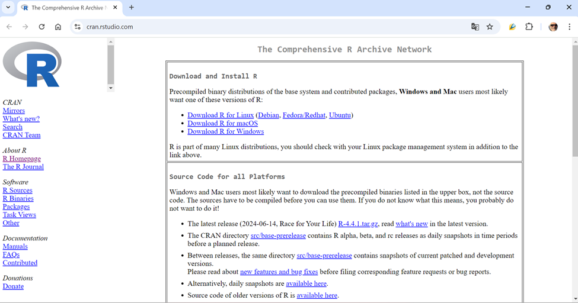{width="60%"}

Vamos a “Install R for the first time”...

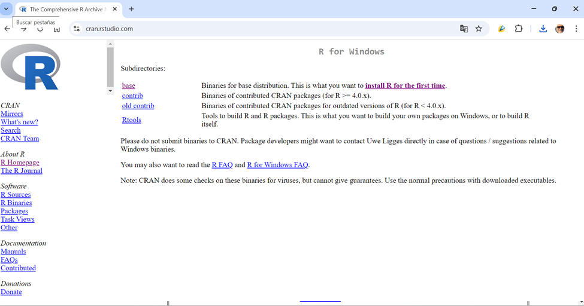{width="60%"}

...y descargamos la ultima versión de R

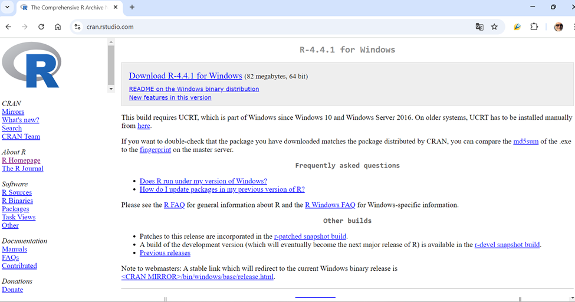{width="60%"}

Ejecutamos el .exe de la instalación y elegimos todas las opciones que vienen por defecto. Luego pasamos a instalar RStudio entrando al sitio <https://posit.co/download/rstudio-desktop/>

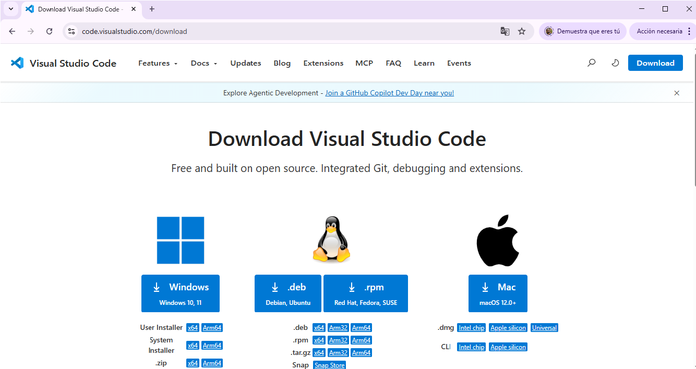{width="60%"}

Hacemos click en el paso 2: Instalar RSudio. Hacemos la instalación utilizando todas las opciones que viene por defaut. Si se nos pregunta, elegimos la versión de 64 bits del programa.

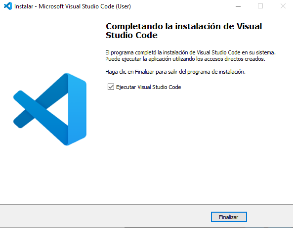{width="60%"}

## Instalación de paquetes

Una vez instalados los programas, abrir *Rstudio* e instalar los principales paquetes a utilizar a lo largo del curso, copiando y ejecutando los siguientes comandos en la consola que aparece en la parte de abajo de la pantalla. Deben tener conexión a internet al momento de realizarlo.

```{r, eval=FALSE}
install.packages("tidyverse",dependencies=TRUE)
install.packages("devtools")
install.packages("eph")
install.packages("openxlsx")
install.packages("ggridges")
install.packages("ggthemes")
install.packages("foreign")
install.packages("janitor")
```

Así se debería ver tu consola luego de copiar y pegar los comandos de instalación. Luego hay que dar enter y comienza el proceso de instalación de los paquetes.

{width="60%"}

No es indispensable, pero si quieren testear que los paquetes se hayan instalado bien, pueden ejecutar la función *library()* para importar alguno de los paquetes instalados como se muestra a continuación:

```{r, eval=FALSE}
library(tidyverse)
```

Es normal que algunos de los paquetes arrojen advertencias (*warnings*) o conflictos con otros paquetes, tal como se muestra debajo. Ello no es motivo de preocupación!

{width="90%"}

Si existió algún error de instalación, al intentar importar un paquete Rstudio explicitamente nos señalará con el término *Error* la existencia de un problema. Por ejemplo:

```{r, eval=FALSE}
Error: package or namespace failed for 'caret' in loadNamespace ...
There is no package names '[xxxxx]'
```

En estos casos, debemos instalar separadamente el paquete indicado ‘[xxxx’] mediante

```{r, eval=FALSE}
install.packages('[xxxx]')
```

# Github y Git

Git y Github son herramientas para el trabajo colaborativo con código. Comenzamos por hacernos un usuario en github.com. Entramos a “Crear una cuenta” e ingresamos con un mail y una nueva clave.

{width="60%"}

Completamos las preguntas que nos hace Github y luego elegimos el plan gratuito. Después de eso ya podemos acceder a nuestro perfil de cuenta.

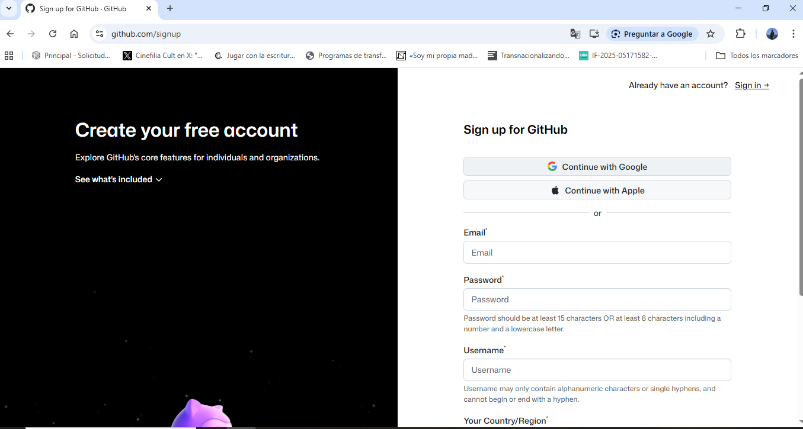{width="60%"}

Ahora nos instalamos Git en nuestra computadora. Vamos a <https://git-scm.com/downloads/win> y elegimos la version de 64bits para Windows.

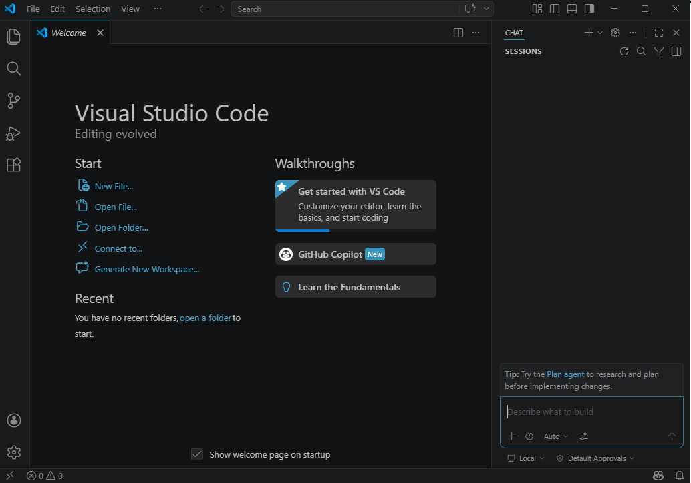{width="60%"}

Ejecutamos el instalador y elegimos todas las opciones por default. Luego abrimos RStudio Elegimos Tools/Global Options. Entramos a las opciones de Git/SVN y podemos chequear que Rstudio haya reconocido la instalación de Git. En caso de que no, debemos buscar el ejecutable git.exe e indicarlo en el path como en la imagen.

{width="60%"}

Vamos a usar el paquete ```usethis``` para configurar Git desde R. Entramos nuestros datos con el siguiente código:

```{r, eval=FALSE}
install.packages("usethis") # Si ya está instalado usethis no es necesario correr esto
library(usethis)
use_git_config(user.name="tu_nombre", user.email="tucorreo@gmail.com.ar") # La dirección de correo debe coincidir con la ingresada en Github
```

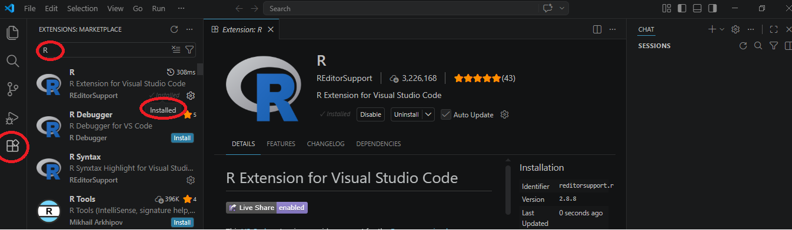{width="60%"}

Es importante que la dirección de correo en `user.email` sea la misma que pusimos al abrir la cuenta en Github. Por su parte, se puede ingresar cualquier dato en `user.name`. Si vas a trabajar desde distintas compus, puede estar bueno setear distintos nombres de usuario para luego identificar desde dónde se hicieron las modificaciones al proyecto.

# Clonando un repositorio

Ahora vamos a clonar el repositorio del curso, donde vamos a ir compartiendo los materiales de las clases. El link para hacerlo es https://github.com/ceped-fce-uba/curso_aset.git. 

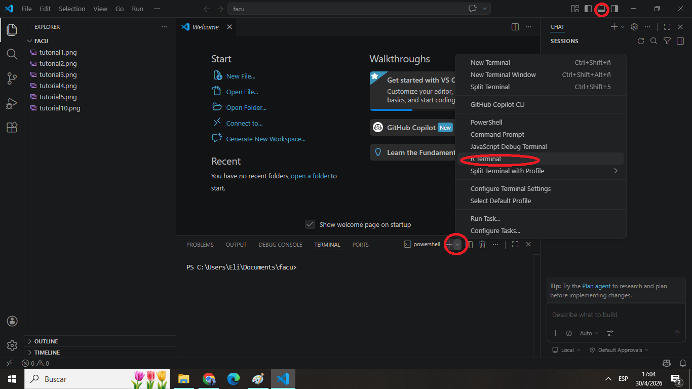{width="60%"}

En el botón verde de “Codigo” vas a encontrar funcionalidades importantes. Entre otas cosas, ahí está disponible el URL que necesitamos para insertar en RStudio: <https://github.com/ceped-fce-uba/curso_aset.git>

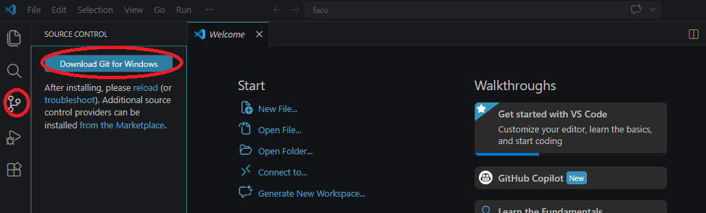{width="60%"}

En RStudio seleccionamos File/New Project, luego elegimos “Version Control” y hacemos click en “Git”.

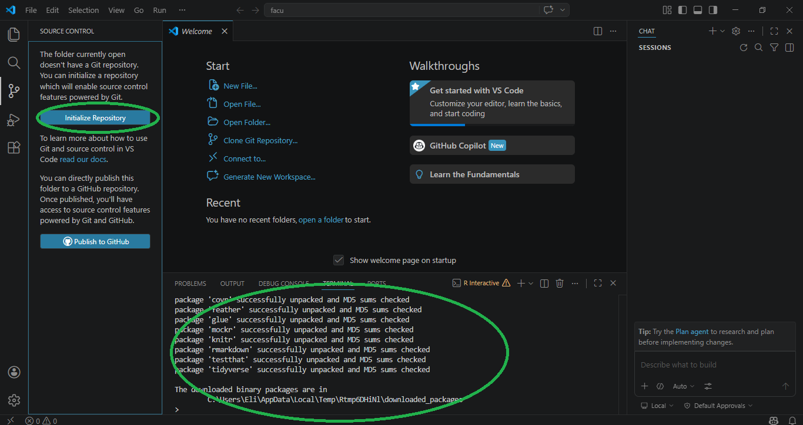{width="60%"}

Insertamos el URL completo en el primer casillero. Si está todo bien se tiene que autocompletar el nombre de la carpeta del proyecto. Hacemos click en “Create Project” y esperamos a la descarga. La descarga puede tardar unos minutos y va a generar un carpeta en tu disco local. Cuando termina, ya estamos trabajando dentro del repositorio ```curso_aset```. Vas a poder encontrar la carpeta usando el explorador de archivos. Por defecto, las carpetas de los respositorios se alojan en Documentos.

