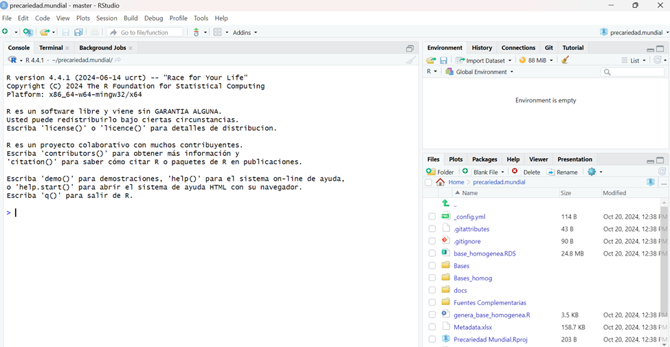
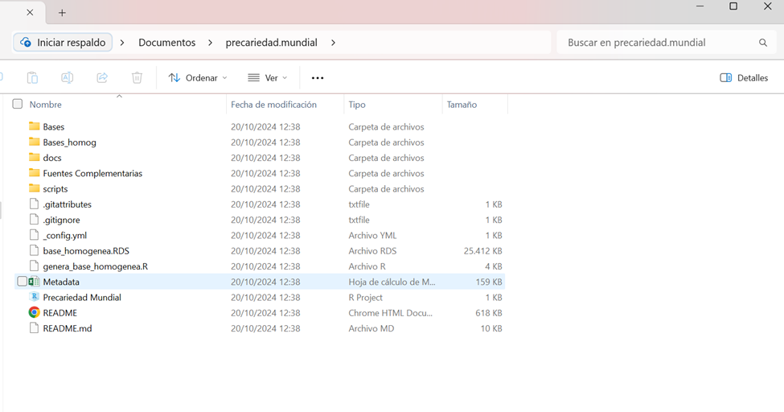

Este tutorial está pensado para instalar R, Rstudio y Git desde cero, sin tener ninguno de estos programas instalados anteriormente. Los ejemplos son para sistema operativo Windows.

# Descargar R y RStudio

Primero descargamos R en https://cran.rstudio.com/ seleccionando tu sistema operativo. 

{width=60%}

Vamos a “Install R for the first time”...

{width=60%}

...y descargamos la ultima versión de R

{width=60%}

Ejecutamos el .exe de la instalación y elegimos todas las opciones que vienen por defecto. Luego pasamos a instalar RStudio entrando al sitio https://posit.co/download/rstudio-desktop/

{width=60%}

Hacemos click en el paso 2: Instalar RSudio. Hacemos la instalación utilizando todas las opciones que viene por defaut. Si se nos pregunta, elegimos la versión de 64 bits del programa. 

{width=60%}

# Github y Git

Mientras RStudio se instala podemos ir haciéndonos un usuario en github.com. Entramos a “Crear una cuenta” e ingresamos con un mail y una nueva clave

{width=60%}

Completamos las preguntas que nos hace Github y luego elegimos el plan gratuito. Después de eso ya podemos acceder a nuestro perfil de cuenta.

{width=60%}

Ahora nos instalamos Git en nuestra computadora. Vamos a https://git-scm.com/downloads/win y elegimos la version de 64bits para Windows.

{width=60%}

Ejecutamos el instalador y elegimos todas las opciones por default. Luego abrimos RStudio Elegimos Tools/Global Options. Entramos a las opciones de Git/SVN y podemos chequear que Rstudio haya reconocido la instalación de Git. En caso de que no, debemos buscar el ejecutable git.exe e indicarlo en el path como en la imagen.

{width=60%}

Vamos a usar el paquete usethis para configurar Git desde R. Entramos nuestros datos con el siguiente código (si ya está instalado usethis no es necesario correr la primera línea): 


```{r, eval=FALSE}
Install.packages(“usethis”)
library(usethis)
use_git_config(user.name="tu_nombre", user.email="tucorreo@gmail.com.ar") #la dirección de correo debe coincidir con la ingresada en Github
```

{width=60%}

Es importante que la dirección de correo en `user.email` sea la misma que pusimos al abrir la cuenta en Github. Por su parte, se puede ingresar cualquier dato en `user.name`. Si vas a trabajar desde distintas compus, puede estar bueno setear distintos nombres de usuario para luego identificar desde dónde se hicieron las modificaciones al proyecto. 

# Clonando un repositorio

Ahora vamos a probar clonando un repositorio hecho por los profes del curso, que vamos a usar mas adelante. Buscá el repositorio precariedad.mundial en github.com/Guidowe/precariedad.mundial


{width=60%}

En el botón verde de “Codigo” vas a encontrar funcionalidades importantes. Entre otas cosas, ahí está disponible el URL entero que necesitamos para insertar en RStudio: https://github.com/Guidowe/precariedad.mundial.git

{width=60%}

En RStudio seleccionamos File/New Project y luego elegimos “Version Control” y “Git”.

{width=60%}

Insertamos el URL completo en el primer casillero. Si está todo bien se tiene que autocompletar el nombre de la carpeta del proyecto. Hacemos click en “Create Project” y esperamos a la descarga. Puede tardar un ratito en clonar el repositorio porque tiene muchas cosas

{width=60%}

Cuando termina la descarga, ya estamos trabajando dentro del proyecto precariedad.mundial. Vas a poder encontrar la carpeta usando el explorador de archivos. Por defecto, las carpetas de los respositorios se alojan en Documentos.

{width=60%}


