Este tutorial está pensado para instalar R, Visual Studio Code y Git desde cero, sin tener ninguno de estos programas instalados anteriormente. Los ejemplos son para sistema operativo Windows.

Si cuando lees cosas como "R", "Visual Studio Code" o "Git" no tenés ni la más menor idea de qué se trata, no te preocupes! En este tutorial vamos a instalar todo lo necesario para poder usar R y Visual Studio Code, y en las próximas clases vamos a ir viendo para qué sirve cada una de estas herramientas y cómo usarlas. En caso de tener problemas en la instalación no dudes en consultar a los docentes del curso.

## Descargar R

Primero descargamos R en https://cran.rstudio.com/ seleccionando tu sistema operativo.

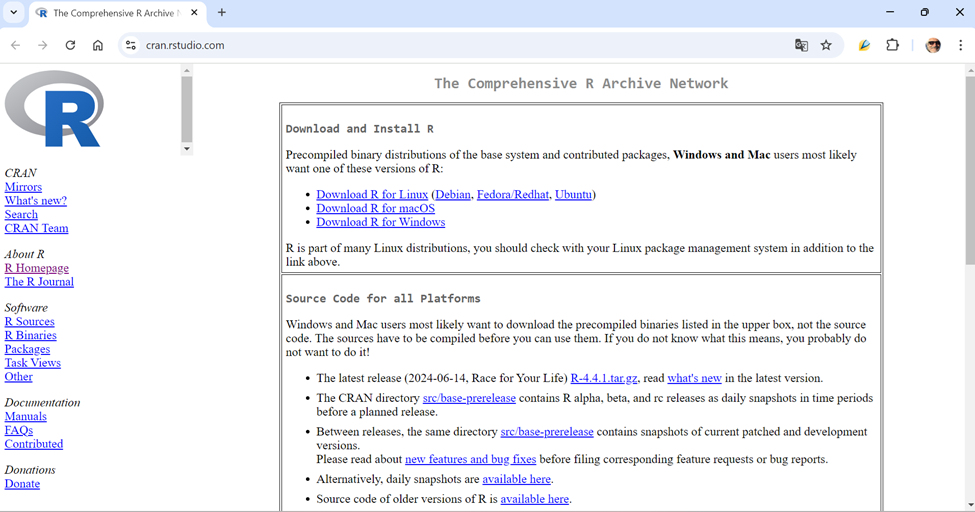{width="60%"}

Vamos a “Install R for the first time”…

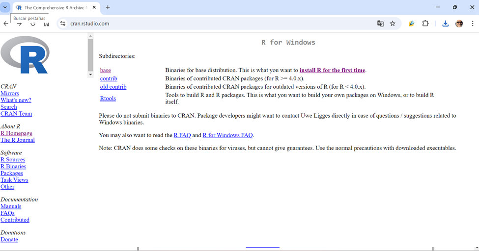{width="60%"}

…y descargamos la ultima versión de R

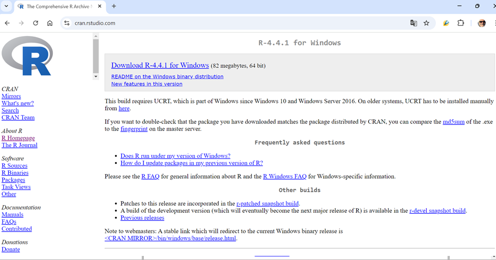{width="60%"}

#  Visual Studio Code

Luego descargamos VSC en https://code.visualstudio.com/download, eligiendo nuestra versión del sistema operativo, descargando el instalador y ejecutándolo.

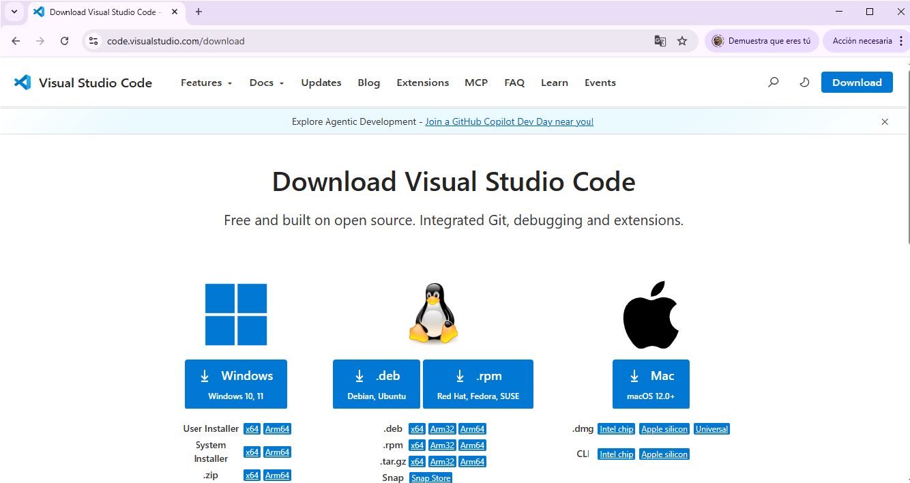{width="60%"}

Le damos "Siguiente" o "Si" a todas las opciones que nos va mostrando el instalador, y luego de unos minutos ya tenemos instalado Visual Studio Code. Si todo va bien, nos debe aparecer la siguiente pantalla y al hacer click en "Finalizar" se abre Visual Studio Code.

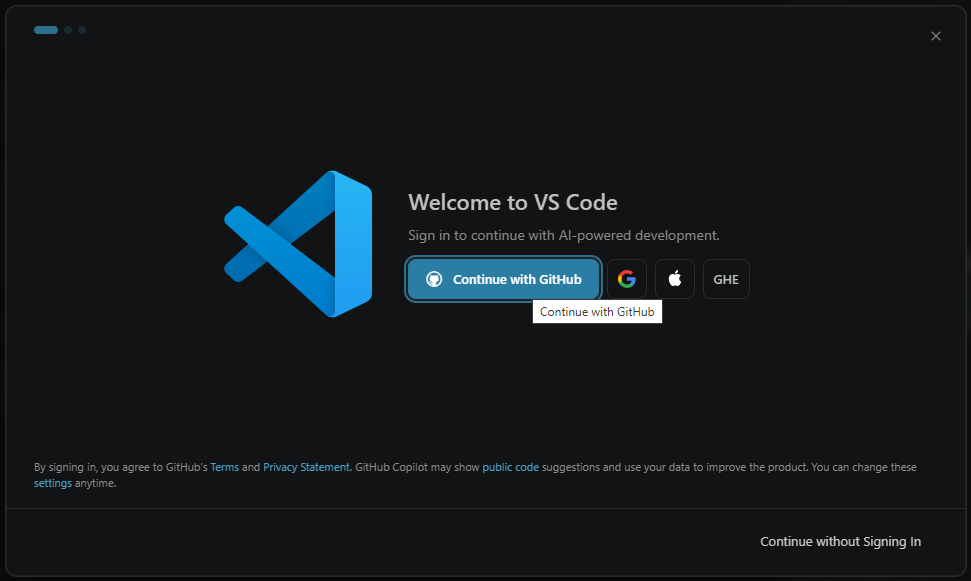{width="60%"}

Lo primero que nos pregunta VSC es si queremos logearnos de alguna manera. Aprovechemos ahora para hacernos usuario de Github y logearnos con esa cuenta. Para eso, entramos a <https://github.com/join> y seguimos los pasos para crear una cuenta.

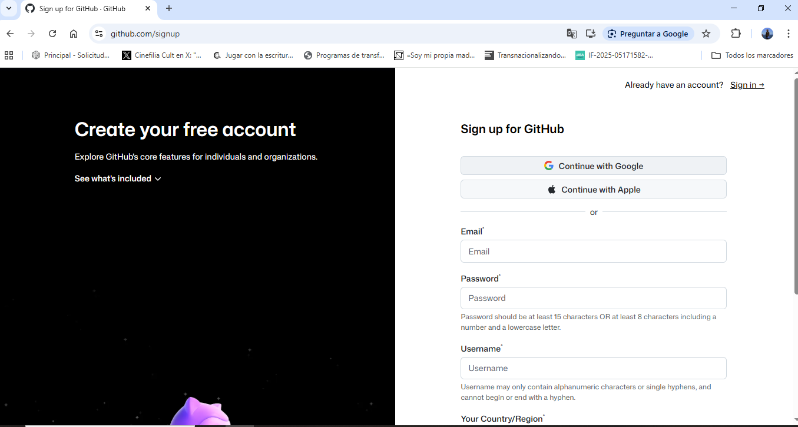{width="60%"}

Para registrarnos en Github podemos usar nuestra cuenta de Google o cualquier mail. Una vez que terminamos de crear la cuenta deberíamos tener acceso a github.com con nuestro usuario. Ahora volvemos a Visual Studio Code y hacemos click en "Sign in with GitHub". Se va a abrir una nueva ventana del navegador para que ingresemos nuestros datos de Github y autoricemos a Visual Studio Code a acceder a nuestra cuenta. Le damos "Si" o "Continuar" a todas las opciones que nos va mostrando el proceso de autorización. Cuando todo esté finalizado deberíamos ver la siguiente pantalla en Visual Studio Code.

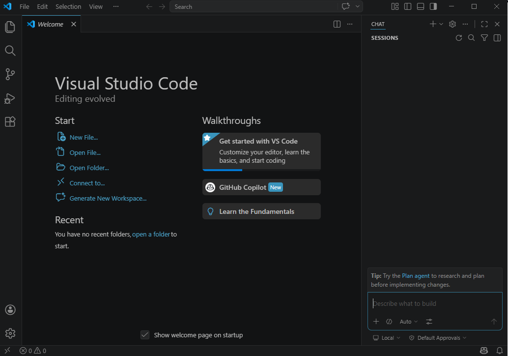{width="60%"}

Si ves esta pantalla, entonces ya tenés Visual Studio Code instalado y estás logeado con tu cuenta de Github. Solo nos queda ir al menu de "Extensions" (el icono de los cuadritos en la barra lateral izquierda) y buscar e instalar la extensión "R Extension for Visual Studio Code" para poder usar VSC como un editor de código R.

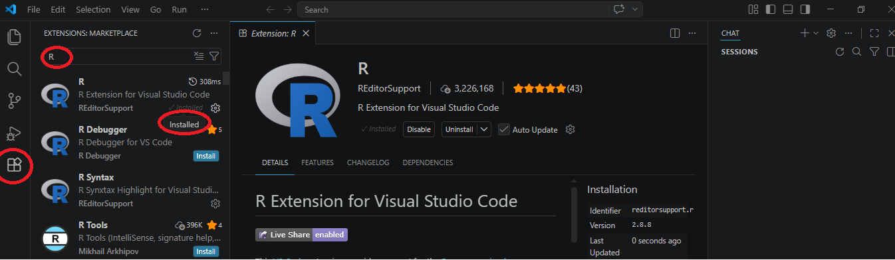{width="60%"}


# Instalación de paquetes

Ya estamos listxs para usar R y Visual Studio Code! Ahora podemos abrir una terminal (el "recuadro" de abajo). Si no te aparece el recuadro primero debes ir al simbolito marcado en rojo arriba a la derecha en la siguiente imagen, luego hacer click en la flechita para abajo que está junto el "+" y elegir "R Terminal" en el menú desplegable. Con eso ya podemos abrir una terminal de R.

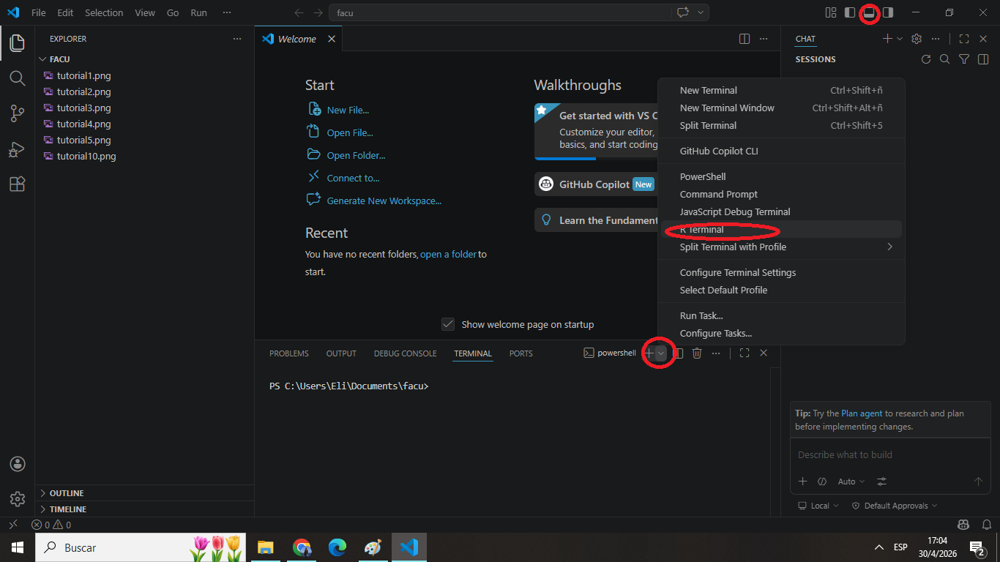{width="60%"}

La terminal de R quedó abierta y ya podemos escribir código R ahí.

Ahora vamos a instalar los principales paquetes a utilizar a lo largo del curso, copiando y ejecutando los siguientes comandos en la consola que aparece en la parte de abajo de la pantalla. Debes tener conexión a internet al momento de realizarlo.

```{r, eval=FALSE}
install.packages("tidyverse",dependencies=TRUE)
install.packages("devtools")
install.packages("eph")
install.packages("openxlsx")
install.packages("ggridges")
install.packages("ggthemes")
install.packages("foreign")
install.packages("janitor")
```

No es indispensable, pero si quieren testear que los paquetes se hayan instalado bien, pueden ejecutar la función *library()* para importar alguno de los paquetes instalados como se muestra a continuación:

```{r, eval=FALSE}
library(tidyverse)
```

Es normal que algunos de los paquetes arrojen advertencias (*warnings*) o conflictos con otros paquetes, tal como se muestra debajo. Ello no es motivo de preocupación!

Si existió algún error de instalación, al intentar importar un paquete Rstudio explicitamente nos señalará con el término *Error* la existencia de un problema. Por ejemplo:

```{r, eval=FALSE}
Error: package or namespace failed for 'caret' in loadNamespace ...
There is no package names '[xxxxx]'
```

En estos casos, debemos instalar separadamente el paquete indicado ‘[xxxx’] mediante

```{r, eval=FALSE}
install.packages('[xxxx]')
```

# Github y Git

Git y Github son herramientas para el trabajo colaborativo con código. VSC tiene como ventaja que está muy bien integrado con GitHub (recordemos que nos logeamos a VSC directamente con Github). Para instalar Git vamos al icono de la izquierda que marcamos en rojo y hacemos click en "Download Git for Windows". Se nos va a abrir una ventana del navegador web y tenemos que elegir la última versión de Git para nuestro sistema operativo, descargar el instaladaor y ejecutarlo dejando todas las opciones por defecto. Al finalizar la instalación, ya tenemos Git instalado y listo para usarlo desde Visual Studio Code.

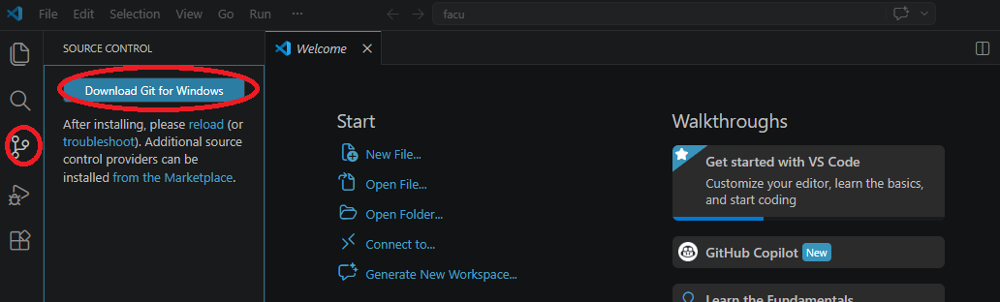{width="60%"}

Cuando tengamos Git ya instalado vamos a ver opciones distintas a "Dowload Git for Windows". Notar que esto lo podemos hacer en paralelo a la instalación de paquetes de R. Por ejemplo, en la siguiente imagen se ve como se fueron instalando los paquetes mientras configurabamos Git.

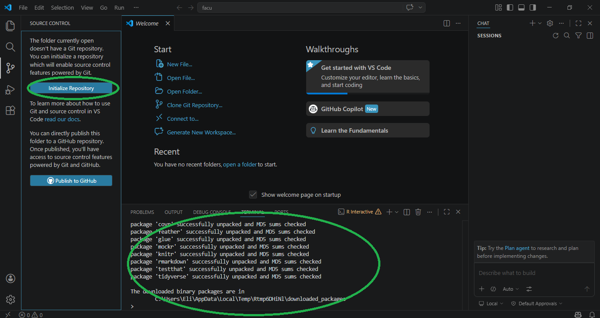{width="60%"}

Listo!! ahora tenés todo el setting listo como para empezar a programar en R y usar GitHub para compartir tu código. Desde la primera clase vamos a empezar a usar todo esto para hacer nuestro primer proyecto de análisis de datos con R. Nos vemos entonces!