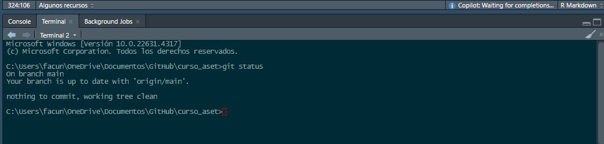
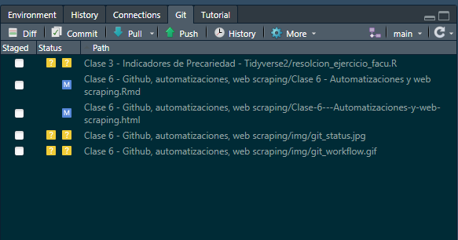
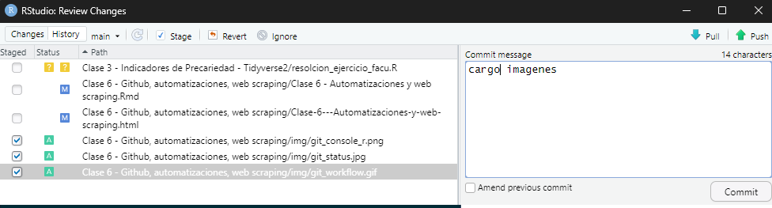
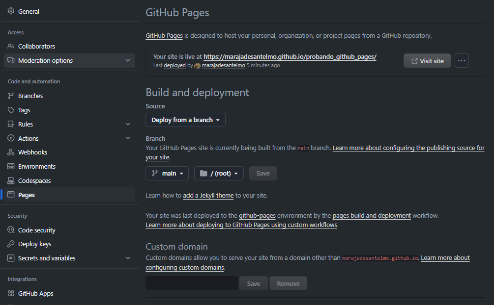

# Introducción a la automatización

En el análisis de datos, la automatización es una habilidad fundamental para ahorrar tiempo, reducir errores y aumentar la eficiencia en tareas repetitivas. Cuando automatizamos procesos, podemos realizar tareas de manera programada, sin intervención manual, lo que resulta en flujos de trabajo más consistentes y escalables. Los lenguajes de programación orientados a objetos, como R, pueden ser muy útiles para la automatización. En este encuentro vamos a cubrir las siguientes actividades vinculadas al diverso mundo de la automatización: identificación de patrones en texto, web scraping y modificación de archivos con R. En la Clase 8 también vamos a trabajar en la interacción con Google Sheets desde R y programación de tareas.

# Expresiones Regulares (Regex) en R

Las **expresiones regulares** (regex) son una herramienta poderosa para buscar, extraer y manipular texto de manera flexible. En R, las regex son ampliamente utilizadas para tareas como limpieza de datos, validación de formatos de texto, y extracción de patrones específicos dentro de cadenas. Las regex permiten definir patrones de texto de una forma concisa, especificando caracteres literales, combinaciones de letras, números, y símbolos especiales. Con ellas, es posible realizar tareas que van desde la simple búsqueda de una palabra en un texto hasta la validación de formatos complejos como correos electrónicos o números de teléfono. El trabajo con regex es una forma avanzada de hacer selecciones como las que trabajamos con los **selection helpers** `starts_with()`, `contains()`, `matches()` y `ends_with()` de **dplyr**.

## Componentes Básicos de las Expresiones Regulares

-   `.`: Representa cualquier carácter.
-   `*`: Cero o más repeticiones del carácter o grupo anterior.
-   `+`: Una o más repeticiones del carácter o grupo anterior.
-   `?`: Cero o una aparición del carácter o grupo anterior.
-   `^`: Inicio de una línea.
-   `$`: Fin de una línea.
-   `[ ]`: Define un conjunto de caracteres. Por ejemplo, `[0-9]` busca cualquier número del 0 al 9.
-   `|`: Alternativa lógica (OR). Por ejemplo, `a|b` busca 'a' o 'b'.
-   `()` : Agrupa caracteres para aplicar operadores.
-   `\`: Escapa caracteres especiales para usarlos como literales.

*Atención!* Hoy en día con las herramientas basadas en IA ya no hace falta aprender cómo redactar una expresión regular, lo que ha facilitado mucho el trabajo con regex. Sí es importante que chequeemos el correcto funcionamiento de nuestra expresión regular para ver si matchea como los esperamos. Una herramienta muy práctica para ello está en <https://reger.com/>

## Funciones Clave de Regex en R

-   `grep()`: Encuentra coincidencias en vectores.
-   `grepl()`: Retorna un valor lógico (`TRUE` o `FALSE`) si encuentra coincidencias.
-   `gsub()`: Reemplaza coincidencias de un patrón en un texto.
-   `str_extract()` y `str_replace()` del paquete **stringr**.

## Ejemplos

### Ejemplo 1: Uso de `grep()` para buscar un patrón en nombre de columna y modificarla

### Ejemplo de análisis de texto

```{r grep-ejemplo}
# Vector de prueba
textos <- c("R es genial", "Regex es poderosa", "R puede ser difícil al principio")

# Buscar la letra "R"
grep("R", textos)

#Buscar la palabra "R"
grep("\\bR\\b", textos)

```

### Ejemplo 2: Uso de `grep()` para buscar un patrón

```{r stringr-ejemplo}
# Cargar la librería stringr
library(stringr)

# Extraer todos los números de una cadena
texto_numeros <- "Hay 12 gatos y 34 perros en 2024"
str_extract_all(texto_numeros, "[0-9]+")
```

### Ejemplo 3: Limpio valores en \$

Es muy común encontrar valores 'sucios' cuando tratamos con montos de dinero en algunas fuentes de datos. El comando `gsub` permite sustitur los strings que matcheen con nuestro regex por los caracteres que queramos. Cuando le pasamos "" como argumento, le estamos diciendo que directamente borre los caracteres que coinciden con nuestra búsqueda

```{r gsub-ejemplo}
# Crear un vector con ejemplos de montos en formato string
montos <- c("$1.345.213,53", "$500,00", "$23.450,50", "$0,99", "$1.000,01", "$12.345.678,90", "$999.999,99", "$3,00")

# Función para limpiar y convertir los montos a numérico
convertir_a_numerico <- function(x) {
  # Eliminar el símbolo $
  x <- gsub("\\$", "", x)
  # Reemplazar puntos por nada (para los miles)
  x <- gsub("\\.", "", x)
  # Reemplazar la coma por un punto para los decimales
  x <- gsub(",", ".", x)
  # Convertir a numérico
  as.numeric(x)
}

# Aplicar la función al vector de montos
montos_limpios <- convertir_a_numerico(montos)

# Ver el resultado
montos_limpios
```

### Ejemplo 4: Seleccionando columnas de la EPH

Con la EPH, supongamos que queremos obtener sólos las columnas que empiezan con "CH". El uso de regex nos permite identificar patrones de texto y extraer las columnas que nos interesan.

```{r eval=FALSE}

individual_t117 <- read.table(file = 'bases/usu_individual_t117.txt',
                              sep=";", 
                              dec=",", 
                              header = TRUE, 
                              fill = TRUE)

colnames(individual_t117)

```

Con la función grep podemos indicar que sólo tome los nombres que comienzan con "CH" del vector generado por la función `colnames`. Notar que en la expresión regular se utiliza el caracter especial `^` para indicar que tiene que ser un patrón que se ubique al comienzo del texto.

```{r eval=FALSE}

ch_columns <- individual_t117[, grep("^CH", colnames(individual_t117))]

ch_columns

```

Este ejemplo puede parecer trivial, pero en la práctica es muy útil para seleccionar columnas de bases de datos con muchas variables y facilita el trabajo de análisis de datos. También sirve para cuando trabajamos con bases datos cuyas variables pueden variar en el nombre de columna pero respetando un patrón.

# Git y Github

Desde el primer encuentro que venimos trabajando con Git y Github, pero siempre hay algo nuevo por conocer cuando se trata de estas herramientas. La lógica general es que podemos hacer cambios, que se agrupan en tandas de cambios llamados `commits`. Luego, esos `commits` se `pushean` al repositorio en la nube. Para bajar los commits que hicieron otros, usamos el comando `pull`. En general, la idea es que cada vez que trabajemos en un proyecto, hagamos un `pull` para tener la última versión del proyecto, y luego un `push` para subir nuestros cambios.

{width="60%"}

## Algunos recursos

[¿Cómo crear una cuenta?](https://docs.github.com/es/get-started/onboarding/getting-started-with-your-github-account)

[Una guía con ejemplos para empezar a usar Git](https://github.com/git-guides)

[Principales comandos](https://git-scm.com/docs):

Git funciona por línea de comandos que se ejecutan por consola. Esta forma de interactuar con git suele ser más eficiente que las interfaces gráficas, aunque estas últimas son más amigables para comenzar. Los comandos más utilizados son:

-   **git clone** clona el repositorio, es decir, nos permite descargar a nuestro directorio local un repositorio.

-   **git status** muestra nuestra situación: el estado de los cambios locales, en qué rama estamos, etc.

-   **git pull** actualiza la línea de desarrollo local con actualizaciones de sus contrapartes remotas. Es decir, descargar a nuestro repositorio local las modificaciones de nuestro equipo.

-   **git add** + **git commit** + **git push** nos permiten enviar nuestros cambios locales al repositorio.

-   **git add** es el primer paso, que agrega archivos nuevos o modificados en el directorio local de trabajo al área de *staging* de Git.

-   **git commit -m "stuve haciendo el cmabio x, y , z"** guarda nuestros cambios al historial de versiones. Todo lo que se haya almacenado provisionalmente con git add pasará a formar parte del historial. Hay que inclur un mensaje entre comillas, usualmente explicando los cambios que hicimos.

-   **git push** envía nuestros cambios y así actualiza el repositorio remoto con las modificaciones (ya commiteadas) realizadas localmente.

Un poco más avanzado:

-   **git branch** muestra las ramas en las que se trabaja localmente.

-   **git merge** combina las líneas de desarrollo. Este comando habitualmente se utiliza para combinar los cambios que se realizan en dos ramas distintas. Por ejemplo, un desarrollador podría hacer una fusión cuando necesite combinar los cambios de una rama de característica en la rama de desarrollo principal.

Podemos ingresar estos comandos directamente en la consola de RStudio o en la de Windows. En el caso de RStudio, se accede directamente en la pestaña de terminal (generalmente ubicada debajo dentro de la ventana de RStudio). En caso de que la terminal no esté visible, abrirla yendo a *Tools -\> Terminal -\> New Terminal*.

{width="60%"}

## Interactuar desde RStudio

RStudio tiene una interfaz gráfica que nos permite interactuar con Github de manera más amigable.

{width="60%"}

Por ejemplo, en la anterior captura de pantalla, podemos ver que hay un cambio en el archivo `Clase 6.Rmd`, que se agregan imágenes y un script en la Clase 3. Para subir algunos de los cambios a Github, tenemos que pasar los cambios a `Staging`. Si queremos por ejemplo subir las imágenes al repositorio, debemos crear un commit.

{width="60%"}

Si queremos bajar los cambios que hicieron otros, hacemos click en `Pull`. También podemos ver el historial de cambios, las ramas, y otras funcionalidades de Git.

## Ignorar archivos con `.gitignore`

Para que los archivos del directorio se tengan en cuenta en el repositorio, deben estar inicializados. Por el contrario, para que los achivos no sean tenidos en cuenta no deben estar inicializados y se debe agregar un archivo `.gitignore` en la raíz del proyecto. Allí se especifican los archivos y carpetas que no queremos que se suban al repositorio. Por ejemplo, si no queremos que se suban los archivos `.RData`, los archivos `.csv` o las carpetas `data` y `img`, el archivo `.gitignore` debería tener el siguiente contenido:

```         
*.RData
*.csv
data/
img/
```

Se trata de un archivo de texto plano que se puede crear con cualquier editor de texto. En general, se recomienda utilizar el archivo `.gitignore` para evitar subir archivos innecesarios al repositorio, como bases de datos pesadas, archivos temporales, o archivos que contienen información sensible (como por ejemplo claves y credenciales).

## Github Pages

Una funcionalidad muy interesante de Github es la posibilidad de hacer páginas web de acceso público con Github pages (ver pages.github.com). Para generar la página web hay que ir a la configuración del repositorio, seleccionar la rama que publicará la página web (por defecto es main) y luego activar Github pages.

{width="60%"}

Por defecto, Github pages toma como página principal el archivo `index.html` o el archivo `README.md` que están en el raíz del directorio. Para crear una página web con Github pages, simplemente hay que subir los archivos al repositorio haciendo **push** y luego de unos minutos el sitio se publica automáticamente. Si estamos trabajando con R, lo más común es que usemos archivos de extensión .md para sitios simples y .Rmd para presentación más complejas. Si le queremos dar formato más lindo, Github viene con el servicio integrado de `jekyll`, que es un generador de sitios estáticos. Con simplemente agregar un archivo `_config.yml` en la raíz del directorio, podemos personalizar el sitio web. Por ejemplo, el siguiente archivo `_config.yml` es el que tenemos en el repositorio del curso

```         
theme: jekyll-theme-slate
title: "Herramientas de programación para la producción y difusión de estadísticas socioeconómicas - ASET"
description: ""
```

Hoy en día existen varios generadores de sitios estáticos que nos permite deployar sitios web estáticos de forma muy sencilla. Muchos de ellos tienen templates muy buenos que nos permiten hacer sitios web muy atractivos sin tener que saber de diseño web. Algunos de los más populares son `Hugo`, `Jekyll`, `Pelican`, `Gatsby`, entre otros. También podemos generar .htmls y arhivos de estilo .css mediante prompts en ChatGPT o cualquier otra herramienta basadas en IA.

# Imputación de datos

En el trabajo con bases de datos, es común encontrarnos con valores faltantes o datos incompletos. La imputación de datos es el proceso de reemplazar los valores faltantes con valores estimados utilizando distintos métodos o modelos para elegir cuál va a ser el valor a imputar para cada caso. Entre las muchísimas formas de aplicar imputaciones, a continuación revisaremos ejemplos de imputación por media, por regresión y un ejemplo (muy sintético) de aplicación de modelos de machine learning.

## Imputaciones por promedios

Una forma muy sencilla de imputar es calcular una métrica para un grupo particular y aplicar el valor de dicha métrica para los miembros del gupo que tienen valores faltantes. Con las herramientas que trabajamos en este curso ya podemos hacer este tipo de imputaciones. Por ejemplo, tomemos la EPH para el primer trimestre del año 2024.

```{r warning=FALSE, eval=FALSE}
library(eph)

variables_EPH <- c("P21", "CAT_OCUP",  "ESTADO", "PP07H", "PP07I",
                   "PP04B1", "PP04A", "REGION", "ANO4", "PONDERA",
                   "REGION", "CH04", "CH06", "PP04C", "PP04C99",
                   "PP04B_COD", "P21")

base <- get_microdata(year=2024, period = 1, vars = variables_EPH )
```

En la variable de ingresos de la ocupación principal (p21), los casos de no respuesta tienen el valor -9. Los vamos a redefinir como NAs para poder trabajar con ellos. Luego definimos grupos en base a las variables edad y región, y por último realizamos la imputación según la media de los ingresos agrupando casos por sexo, edad y región.

```{r warning=FALSE, eval=FALSE}
# Asigno NAs a casos con variable de ingreso de la ocupación principal igual a -9
base$P21[base$P21 == -9] <- NA

# Filtro ocupados y genero variables de grupos etarios y regiones
base <- base %>%
  filter(ESTADO==1) %>% 
  mutate(
          edad=CH06, 
          edad2=edad*edad,
          tramo_etario= case_when(
            edad<=30 ~ "Joven", 
            edad>30 & edad<=50 ~ "Adulto", 
            edad>50 ~ "Adulto mayor"),
          sexo= case_when(
            CH04 ==1 ~ "Hombre", 
            CH04 ==2 ~ "Mujer"), 
         region= factor(
           case_when(
             REGION ==01 ~ "AMBA", 
             REGION ==43 ~ "Centro",
             REGION ==40 ~ "NOA",
             REGION ==41 ~ "NEA",
             REGION ==42 ~ "Cuyo",
             REGION ==44 ~ "Patagonia"), 
           levels=c("AMBA", "Centro", "NEA", "Cuyo", "Patagonia", "NOA")),
         sexo= factor(sexo,
              levels=c("Mujer", "Hombre")))

base <- base %>% select(sexo, edad, region, edad2, tramo_etario, P21)

base <- base %>%
  group_by(sexo, tramo_etario, region) %>%
  mutate(P21_imputado = ifelse(is.na(P21), mean(P21, na.rm = TRUE), P21)) %>%
  ungroup()
```

Esta forma de imputar (muy simple y sencilla) tan sólo asigna los siguientes valores a los casos con NA.

```{r warning=FALSE, eval=FALSE}
library(kableExtra)

tabla <- base %>%
  group_by(sexo, tramo_etario, region) %>%
  summarise(P21_imputado = mean(P21, na.rm = TRUE)) 

tabla %>% 
  head(10) %>% 
  kable(caption = "<b>Tabla 1. </b> Valores imputados en el ejemplo") %>% 
  kable_styling(bootstrap_options = c("striped"), full_width = F,  position = "float_left")

```

A pesar de ser muy simple, este ejemplo nos sirve para entender la lógica de las imputaciones: reemaplazar los NAs con valores basados en la información de otros casos. En la práctica, las imputaciones suelen ser más complejas. En el siguiente ejemplo vamos a ver cómo se puede hacer una imputación de ingresos utilizando un modelo de regresión lineal.

## Regresión

Muy sintéticamente, una regresión es un modelo matemático que busca establecer una relación entre una variable dependiente y una o más variables independientes. Para una imputación, la variable dependiente es la que tiene valores faltantes y las variables independientes son las que se utilizan para predecirlos.

$$
P_{21} = \beta_0 + \beta_1 \cdot \text{edad} + \beta_2 \cdot \text{edad}^2 + \beta_3 \cdot \text{sexo} + \beta_4 \cdot \text{región} + \beta_5 \cdot \text{tramo_etario} + \epsilon
$$

En este caso, vamos a utilizar un modelo de regresión lineal para imputar los valores faltantes de la variable de ingresos. Para ello, vamos a utilizar las variables de edad, edad al cuadrado, sexo, región y tramo etario como predictores. Utilizamos la función `lm()` para ajustar el modelo y luego vamos a predecir los valores faltantes.

```{r warning=FALSE, eval=FALSE}
# Creamos el elemento modelo
modelo <- lm(P21 ~ edad + edad2 + sexo + region + tramo_etario, data = base)

#Lo aplicamos con nuestra base de datos
base$P21_prediccion<- predict(modelo, newdata = base)

#Completamos los datos sobre los casos falantes
base$p21_imputado_regresion <- ifelse(is.na(base$P21), base$P21_prediccion, base$P21)

```

En este caso, el modelo de regresión lineal nos permite predecir los valores faltantes de la variable de ingresos utilizando la información de las variables de edad, edad al cuadrado, sexo, región y tramo etario. En la práctica los modelos econométricos suelen estudiarse y ajustarse con más detalle, lo que queda por fuera del alancance de este curso.

## Modelo de Machine Learning

Los modelos de machine learning son una herramienta poderosa para imputar valores faltantes en bases de datos. En este caso, vamos a utilizar un modelo de regresión de *random forest* para imputar los valores faltantes de la variable de ingresos. Para ello, vamos a utilizar las variables de edad, edad al cuadrado, sexo, región y tramo etario como predictores. Utilizamos la función `ranger()` del paquete `ranger` para ajustar el modelo.

```{r warning=FALSE, eval=FALSE}

# Instalar y cargar el paquete ranger si no lo tenes instalado
# install.packages("ranger")
library(ranger)

# Creamos el elemento modelo
base_train <- base %>% filter(!is.na(P21))
modelo_ml <- ranger(P21 ~ edad + edad2 + sexo + region + tramo_etario, data = base_train)

#Lo aplicamos con nuestra base de datos
base$P21_prediccion_ml <- predict(modelo_ml, data = base)$predictions

#Imputamos valores de p21 sólo a las filas con NAs en dicha variable
base$p21_imputado_ml <- ifelse(is.na(base$P21), base$P21_prediccion_ml, base$P21)

```

Al igual que con las regresiones, normalmente los modelos de machine learning se trabajan con mucha profundidad, evaluando distintas métricas de performance, tipos de modelos y utilizando datasets diferenciados para su entrenamiento y validación.
