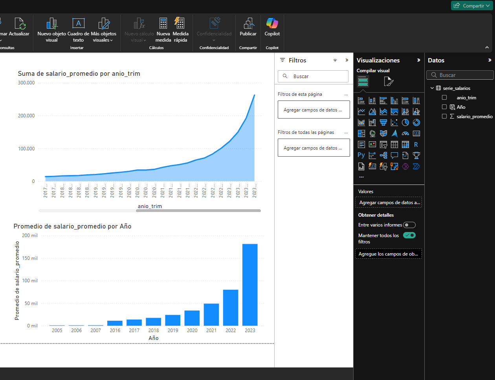
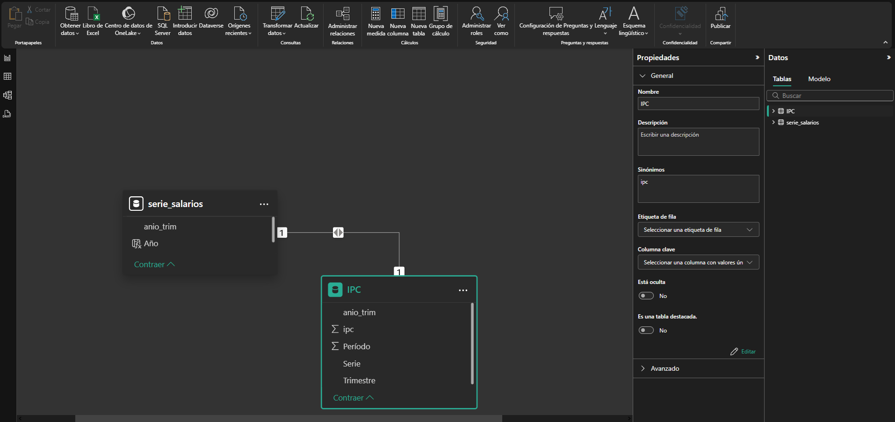
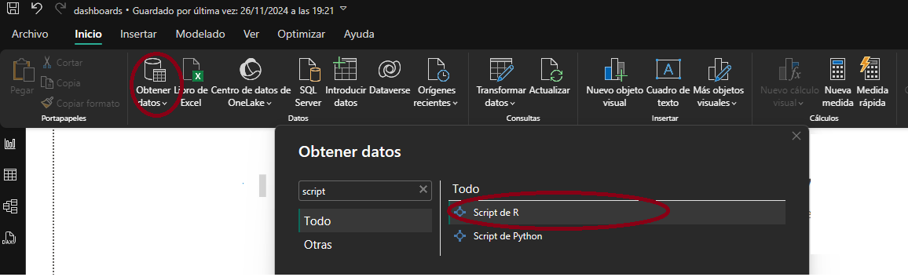
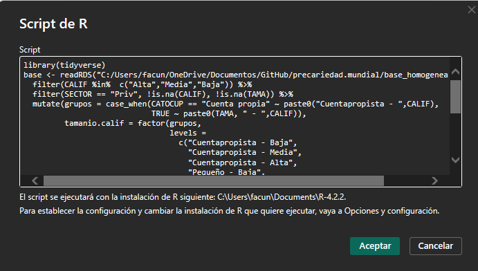

Las herramientas de visualización en tableros (o dashboards) son una forma de presentar información de manera atractiva y accesible.  Los tableros interactivos permiten transformar conjuntos de datos complejos en narrativas visuales que facilitan la comunicación y el entendimiento de la información. Estas herramientas se caracterizan por tomar datos de distintas fuentes, procesarlos y presentarlos de manera visual, interactiva y dinámica. 

Para ello se crean "modelos semánticos" que hacen "consultas" (o querys) a las fuentes de datos elegidas para así obtener la información que se quiere mostrar. Luego estos softwares realizan  cálculos sobre los datos que reciben como input y los muestran en gráficos interactivos. La calidad y eficiencia de los dashboards dependen en gran medida de cómo procesamos y preparamos los datos antes de integrarlos a la visualizuaciäon. En este punto, herramientas como R son grandes aliadas para limpiar, transformar y reducir el volumen de datos, optimizando así el rendimiento y la claridad de las visualizaciones.

Si bien la elaboración de deashboards suele estar asociadas al mundo del BI (Business Intelligence), también pueden ser utilizadas para presentar estadísticas económicas y socio-laborales, de forma manera clara y comprensible. Para Argentina está el ejemplo de los tableros desarrollados en PowerBI por el [CEP XXI - Centro de Estudios para la Producción](https://www.argentina.gob.ar/produccion/cep/tableros-interactivos) con información de estadísticas socio-laborales.


# Introducción a PowerBI

## Organización del trabajo

El trabajo en Power BI se organiza en varias etapas, aunque en la práctica las llevamos a cabo de forma simultánea y recursiva:

1. **Conexión a fuentes de datos**:
   - Se importan datos desde diversas fuentes, como bases de datos SQL, archivos Excel, APIs, y un larguísimo etc.
   - Power BI ofrece un conector para cada tipo de fuente, permitiendo integrar información desde múltiples orígenes.

2. **Modelado de datos**:
   - Se estructuran las tablas y relaciones entre ellas.
   - Se crean columnas calculadas, tablas calculadas y medidas utilizando DAX (Data Analysis Expressions) para preparar los datos y realizar cálculos personalizados.

3. **Transformación y limpieza de datos**:
   - Usando PowerQuery, se preparan los datos mediante pasos como eliminar duplicados, filtrar filas, combinar tablas o realizar transformaciones para que estén listos para el análisis.

4. **Creación de visualizaciones**:
   - Se diseñan gráficos, tablas, mapas y otros objetos visuales que representan los datos de manera clara y efectiva.
   - Se configuran filtros, segmentadores y botones interactivos para mejorar la experiencia del usuario.

5. **Diseño de informes**:
   - Se estructuran las visualizaciones en páginas o pestañas del informe, asegurando que el diseño sea visualmente atractivo y lógico.
   - Se agregan títulos, leyendas y explicaciones para facilitar la interpretación.

6. **Publicación y colaboración**:
   - Los informes se publican en el servicio de Power BI (Power BI Service) para compartirlos con otros usuarios.
   - Se configuran paneles (dashboards) que consolidan las visualizaciones más importantes.
   - Se gestionan permisos y accesos para que los usuarios puedan interactuar con los datos.

## Interfaz de PowerBI

PowerBI ofrece una interfaz gráfica muy amigable que integra todos estos pasos. El siguiente Cheatsheet resume bien las principales funcionalidades a las que podemos acceder en la pantalla principal del programa.


## Ejemplo

Veamos resumidamente como podemos organizar un flujo de trabajo procesando datos en R y visualizándolos con PowerBI. Vamos a comenzar creando una serie de salario nominal en base a la EPH como lo hicimos en la quinta clase. Primeros descargamos las bases de interés con el paquete ```eph```.

```{r message=FALSE, warning=FALSE}
library(tidyverse)
library(openxlsx)
library(eph)

variables <- c('ANO4', 'TRIMESTRE', 'AGLOMERADO','P21', 'PONDIIO')
bases <- eph::get_microdata(year = 2003:2023,period =1:4, vars = variables)

```
Luego filtramos y procesamos la informacion.

```{r message=FALSE, warning=FALSE}
bases <- bases %>% 
  mutate(anio_trim  = paste0(ANO4,"T",TRIMESTRE))

base_salarios <- bases %>% 
  filter(ESTADO == 1, CAT_OCUP ==3,P21>0)

serie_salarios <- base_salarios %>% 
group_by(anio_trim) %>% 
summarise(salario_promedio = weighted.mean(P21,PONDIIO))

serie_salarios2 <- serie_salarios %>% 
  mutate(salario_promedio = round(salario_promedio,0))
```

Finalmente exportamos la serie de salario promedio a un archivo Excel.

```{r message=FALSE, warning=FALSE}

wb <- createWorkbook() 
addWorksheet(wb, "serie_salarios")
writeData(wb, "serie_salarios", serie_salarios)
saveWorkbook(wb, "serie_salarios.xlsx", overwrite = TRUE)

```

Una vez que tenemos el archivo excel guardado, establecemos una conexión con PowerBI y cargamos la serie de salario promedio. Para ello, seleccionamos la opción "Obtener datos" y elegimos el archivo Excel que acabamos de crear. Tener en cuenta que las modificaciones que se realicen en el archivo Excel no se verán reflejadas en PowerBI hasta que se actualice la fuente de datos. Para ello, se debe hacer clic en "Actualizar" en la pestaña "Inicio" de PowerBI.



Cuando tenemos la información cargada, nuestra base con la serie de salarios nos va a aparecer disponible como tabla a la derecha de la pantalla. Podemos hacer clic en la tabla para visualizar los datos y comenzar a trabajar con ellos. Además de crear gráficos, también podemos introducir filtros, cálculos en 'scorecards' y medidas personalizadas utilizando DAX (Data Analysis Expressions).

## Ejemplo de tablas relacioandas

Además es posible relacionar tablas, lo que puede ser útil para agregar diccionarios o información relacionada entre sí que luego queramos visulizar. Hagamos la prueba de transformar nuestra serie de salario nominal a salario real con tablas relacionadas. Vamos a crear una tabla con los valores de inflación mensual para el período 2003-2023, tomando el excel que está en la carpeta ```/bases``` de esta clase. En el panel izquierdo de PowerBI se encuentra la opción "Modelo de datos" donde se pueden ver las tablas que se han importado y las relaciones entre ellas. Para crear una relación, se debe hacer clic en la columna que se quiere relacionar y arrastrarla a la columna correspondiente en la otra tabla. PowerBI intentará detectar automáticamente la relación, pero en caso de que no lo haga, se puede configurar manualmente.



Una vez que se han relacionado las tablas, se pueden realizar cálculos que involucren ambas tablas. Por ejemplo, se puede crear una medida que calcule el salario real a partir del salario nominal y la inflación mensual con la siguiente sintaxis: ```Salario real = serie_salarios[salario_promedio] * 100 / RELATED(IPC[ipc])``` donde ```serie_salarios``` es la tabla con la serie de salarios promedio y ```IPC``` es la tabla con la inflación mensual. La función ```RELATED``` permite acceder a los valores de la tabla relacionada.


## Conexión de PowerBI con R

PowerBI tiene disponible una integración con R, que permite levantar y transformar la información directamente con un script. Para ello, se utiliza el conector "R Script" que permite ejecutar código R en PowerBI y utilizar los resultados en las visualizaciones.



Luego podemos introducir un código que realice las operaciones que queramos. PowerBI tomará el objeto base y lo convertirá en una tabla que podremos utilizar en las visualizaciones. En la imagen mostramos cómo podemos usar el script de la página de Ejemplos de Uso del repositorio Precariedad Mundial para obtener información sobre la estructrura del empleo según perfiles ocupacionales.



# Sintaxis DAX en Power BI

DAX (Data Analysis Expressions) es el lenguaje utilizado en Power BI para realizar cálculos avanzados en columnas calculadas, medidas y tablas calculadas. Su versatilidad lo convierte en una herramienta esencial para generar análisis detallados y personalizados, especialmente en ámbitos como las estadísticas socio-laborales.

## Conceptos básicos de DAX

DAX se utiliza para:
1. **Columnas calculadas**: Nuevas columnas basadas en datos existentes.
2. **Medidas**: Cálculos dinámicos que dependen del contexto (filtros aplicados en las visualizaciones).
3. **Tablas calculadas**: Nuevas tablas generadas mediante cálculos basados en otras tablas.

Algunos aspectos clave de DAX incluyen:
- Funciones similares a Excel, pero optimizadas para trabajar con modelos de datos.
- Contexto de fila (para cálculos en columnas) y contexto de filtro (para cálculos en medidas).
- Amplia variedad de funciones estadísticas, lógicas y temporales.

# Pubicación en PowerBI Service

Una vez que hemos creado nuestro informe en PowerBI, podemos publicarlo en el servicio de PowerBI para compartirlo con otros usuarios. Para ello, se debe hacer clic en "Publicar" en la pestaña "Inicio" de PowerBI. Luego, se puede acceder al informe desde cualquier navegador web, permitiendo a otros usuarios interactuar con los datos y visualizaciones.

El servicio de PowerBI es gratuito para usuarios individuales, mientras que es pago para organizaciones que requieran funcionalidades adicionales como colaboración, administración de permisos y almacenamiento en la nube. Cuando hay informes subidos en PowerBI Service, se pueden automatizar las actualizaciones, ya sea programando consultas a los archivos de una computadora local o en la nube. Por ejemplo, se podría programar que se ejecute un script de R para que baje información de un respositorio de GitHub, procese esa información y luego se actualice un informe en PowerBI.

# Mejorando la estética de nuestros dashboards

Al igual que la comida, la información entra antes que nada por los ojos! Por eso, es importante cuidar la estética de nuestros dashboards para que sean atractivos y fáciles de leer. Algunas recomendaciones para mejorar la presentación de los datos en PowerBI incluyen:

1. **Usar colores y fuentes coherentes**: Mantener una paleta de colores y una fuente de texto consistente en todo el dashboard.
2. **Evitar la sobrecarga de información**: No saturar el dashboard con demasiados elementos visuales o datos.
3. **Utilizar gráficos adecuados**: Elegir el tipo de gráfico más adecuado para representar los datos de forma clara y efectiva.

Para mejorar la estética de los dashboard se suele agregar un 'lienzo' detrás de los objetos visuales para darle un marco más atractivo. También se pueden agregar imágenes, logos o iconos para personalizar el diseño. Además, es importante mantener una jerarquía visual clara, utilizando títulos, subtítulos y leyendas para guiar al usuario a través de la información. Hay muchos servicios gratuitos en la web que ofrecen plataformas para hacer diseño gráfico sin necesidad de ser expert@ en el tema. Por ejemplo, [Figma](https://www.figma.com), [Canva](https://www.canva.com), [Crello](https://crello.com), [Piktochart](https://piktochart.com/), entre otros.