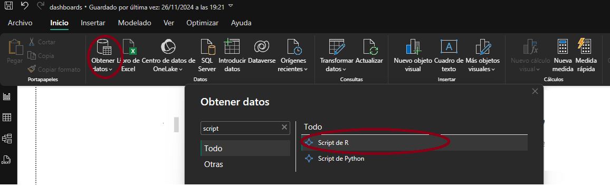
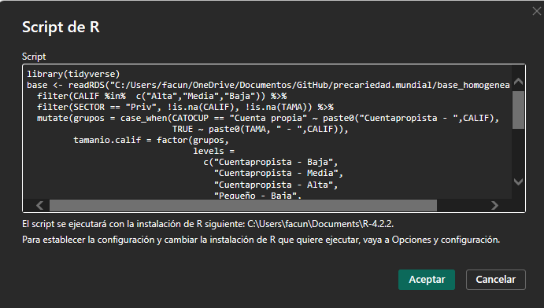
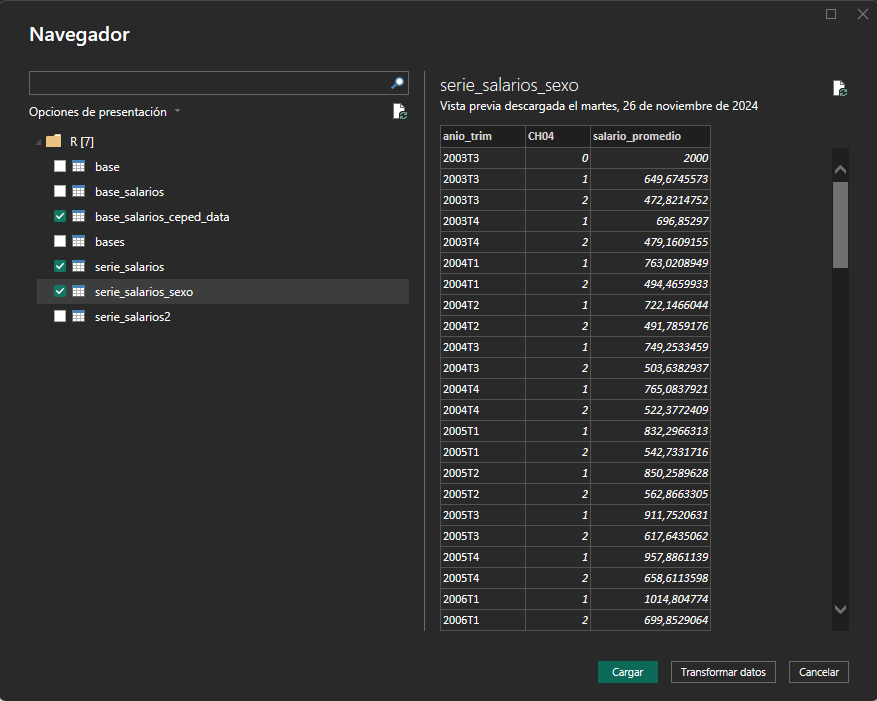
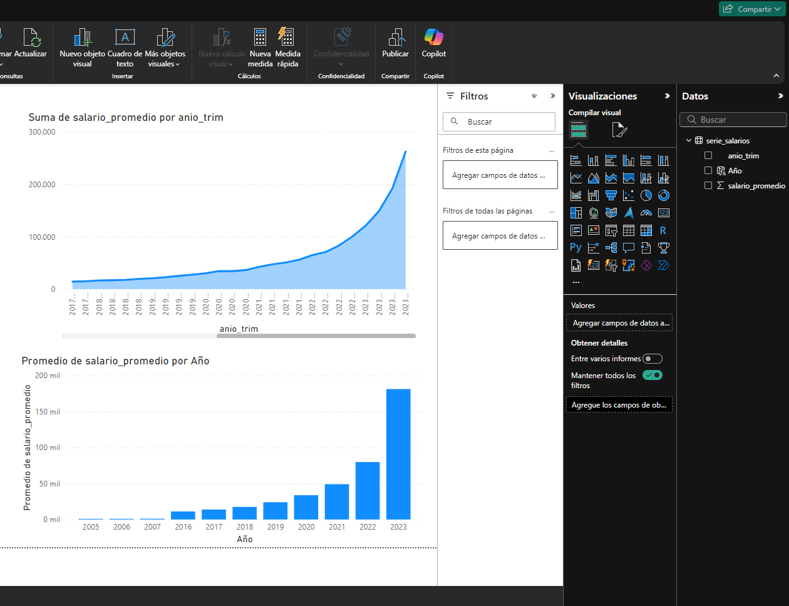
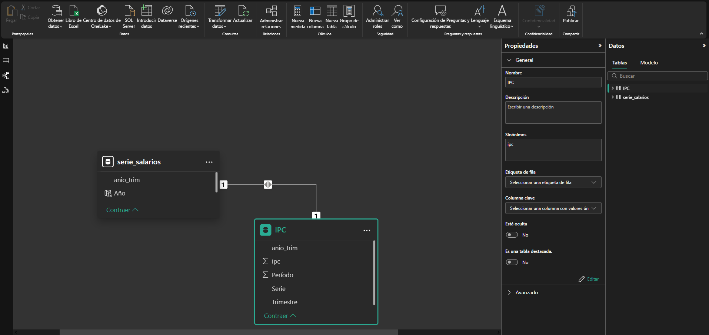

Las herramientas de visualización en tableros (o dashboards) son una forma de presentar información de manera atractiva y accesible.  Los tableros interactivos permiten transformar conjuntos de datos complejos en narrativas visuales que facilitan la comunicación y el entendimiento de la información. Estas herramientas se caracterizan por tomar datos de distintas fuentes, procesarlos y presentarlos de manera visual, interactiva y dinámica. 

Para ello se crean "modelos semánticos" que hacen "consultas" (o queries) a las fuentes de datos elegidas para así obtener la información que se quiere mostrar. Luego, softwares como PowerBI realizan  cálculos sobre los datos que reciben como input y los muestran en gráficos interactivos. La calidad y eficiencia de los dashboards dependen en gran medida de cómo procesamos y preparamos los datos antes de integrarlos a la visualización. En este punto, herramientas como R son grandes aliadas para limpiar, transformar y reducir el volumen de datos, optimizando así el rendimiento y la claridad de las visualizaciones.

> **Ejemplo:** Si bien los dashboards suelen usarse mucho en el ámbito profesional, estas herramientas pueden ser utilizadas para presentar estadísticas económicas y socio-laborales de manera clara y comprensible. [CEP XXI - Centro de Estudios para la Producción](https://www.argentina.gob.ar/produccion/cep/tableros-interactivos) desarrolló tableros interactivos en PowerBI para presentar estadísticas del mercado de trabajo y la producción de Argentina de forma visual y accesible.

# Introducción a PowerBI

## Organización del trabajo

El trabajo en Power BI se organiza en varias etapas, aunque en la práctica las llevamos a cabo de forma simultánea y recursiva:

1. **Conexión a fuentes de datos**:
   - Se importan datos desde diversas fuentes, como bases de datos SQL, archivos Excel, APIs, y un larguísimo etc.
   - Power BI ofrece un conector para cada tipo de fuente, permitiendo integrar información desde múltiples orígenes.

2. **Modelado de datos**:
   - Se estructuran las tablas y relaciones entre ellas.
   - Se crean columnas calculadas, tablas calculadas y medidas utilizando DAX (Data Analysis Expressions) para preparar los datos y realizar cálculos personalizados.

3. **Transformación y limpieza de datos**:
   - Usando PowerQuery, se preparan los datos mediante pasos como eliminar duplicados, filtrar filas, combinar tablas o realizar transformaciones para que estén listos para el análisis.

4. **Creación de visualizaciones**:
   - Se diseñan gráficos, tablas, mapas y otros objetos visuales que representan los datos de manera clara y efectiva.
   - Se configuran filtros, segmentadores y botones interactivos para mejorar la experiencia del usuario.

5. **Diseño de informes**:
   - Se estructuran las visualizaciones en páginas o pestañas del informe, asegurando que el diseño sea visualmente atractivo y lógico.
   - Se agregan títulos, leyendas y explicaciones para facilitar la interpretación.

6. **Publicación y colaboración**:
   - Los informes se publican en el servicio de Power BI (Power BI Service) para compartirlos con otros usuarios.
   - Se configuran paneles (dashboards) que consolidan las visualizaciones más importantes.
   - Se gestionan permisos y accesos para que los usuarios puedan interactuar con los datos.

## Interfaz de PowerBI

PowerBI ofrece una interfaz gráfica muy amigable que integra todos estos pasos. El siguiente Cheatsheet resume bien las principales funcionalidades a las que podemos acceder en la pantalla principal del programa.


## Ejemplo

Veamos resumidamente como podemos organizar un flujo de trabajo procesando datos en R y visualizándolos con PowerBI. Vamos a comenzar creando una serie de salario nominal en base a la EPH como lo hicimos en la quinta clase. Primero descargamos las bases de interés con el paquete ```eph```.

```{r message=FALSE, warning=FALSE}
library(tidyverse)
library(openxlsx)
library(eph)

variables <- c('ANO4', 'TRIMESTRE', 'AGLOMERADO', 'CH04', 'ESTADO', 'CAT_OCUP', 'P21', 'PONDIIO')

#Descomentar para correr por primera vez: se descargan y guardan bases EPH
#bases <- eph::get_microdata(year = 2003:2026,period =1:4, vars = variables)
#saveRDS(bases, "Clase 7 - PowerBI/bases/bases_eph.Rds")

#Abro bases guardadas
bases <- readRDS("bases/bases_eph.Rds")
```

Luego filtramos y procesamos la información para crear una tabla con el salario promedio general.

```{r message=FALSE, warning=FALSE}
bases <- bases %>% 
  mutate(anio_trim  = paste0(ANO4,"T",TRIMESTRE))

base_salarios <- bases %>% 
  filter(ESTADO == 1, CAT_OCUP ==3,P21>0)

serie_salarios <- base_salarios %>% 
group_by(anio_trim) %>% 
summarise(salario_promedio = weighted.mean(P21,PONDIIO))

serie_salarios2 <- serie_salarios %>% 
  mutate(salario_promedio = round(salario_promedio,0))
```

También generamos una nueva tabla desagregada por sexo.

```{r message=FALSE, warning=FALSE}
serie_salarios_sexo <- base_salarios %>% 
  group_by(anio_trim, CH04) %>% 
  summarise(salario_promedio = weighted.mean(P21,PONDIIO))
```

Finalmente exportamos la serie de salario promedio a un archivo Excel para visualizarla y ver si están OK los datos.

```{r message=FALSE, warning=FALSE}

wb <- createWorkbook() 
addWorksheet(wb, "serie_salarios")
writeData(wb, "serie_salarios", serie_salarios)

addWorksheet(wb, "serie_salarios_sexo")
writeData(wb, "serie_salarios_sexo", serie_salarios_sexo)

saveWorkbook(wb, "serie_salarios.xlsx", overwrite = TRUE)

```

Los datos en Excel podrían ser importados en PowerBI, pero lo mejor en este caso será subir el script de R a PowerBI directamente. El archivo excel nos quedará a mano para revisar datos si es necesario.

## Conexión de PowerBI con R

PowerBI tiene disponible una integración con R, que permite levantar y transformar la información directamente con un script. Para ello, se utiliza el conector "R Script" que permite ejecutar código R en PowerBI y utilizar los resultados en las visualizaciones.

{width=60% style="display:block;margin:0 auto;"}

Luego podemos introducir un código que realice las operaciones que queramos. En este caso tomamos el script ```scripts_pbi.R```, que realiza los procesamientos de más arriba y también lee bases de datos de repositorios. PowerBI va a correr el script y va a convertir los dataframes resultantes en tablas que podremos utilizar en las visualizaciones.

{width=60% style="display:block;margin:0 auto;"}

Una vez que corremos el script, nos aparecerá una ventana con las tablas resultantes. Podemos seleccionar las tablas que queremos importar a PowerBI y hacer clic en "Cargar" para agregarlas al modelo de datos.

{width=60% style="display:block;margin:0 auto;"}

Cuando tenemos la información cargada, los dataframes seleccionados van a estar disponibles como tablas a la derecha de la pantalla. Podemos hacer clic en la tabla para visualizar los datos, seleccionar columnas e incluirlos en las visualizaciones. Además de crear gráficos, también podemos introducir filtros, cálculos en 'scorecards' y medidas personalizadas utilizando DAX (Data Analysis Expressions).

{width=60% style="display:block;margin:0 auto;"}


## Ejemplo de tablas relacionadas

Además es posible relacionar tablas, lo que puede ser útil para agregar diccionarios o información relacionada entre sí que luego queramos visualizar. Hagamos la prueba de transformar nuestra serie de salario nominal a salario real con tablas relacionadas. Vamos a crear una tabla con los valores de inflación mensual para el período 2003-2023, tomando el excel que está en la carpeta ```/bases/ipc_trimestral.xlsx``` de esta clase. En el panel izquierdo de PowerBI se encuentra la opción "Modelo de datos" donde se pueden ver las tablas que se han importado y las relaciones entre ellas. Para crear una relación, se debe hacer clic en la columna que se quiere relacionar y arrastrarla a la columna correspondiente en la otra tabla. PowerBI intentará detectar automáticamente la relación, pero en caso de que no lo haga, se puede configurar manualmente.



Una vez que se han relacionado las tablas, se pueden realizar cálculos que involucren ambas tablas utilizando la sintaxis DAX. En este caso, para calcular el salario real ajustado por inflación, podemos crear una medida que divida el salario nominal por el índice de precios al consumidor (IPC) correspondiente al período.

# Sintaxis DAX en Power BI

DAX es el lenguaje utilizado en Power BI para realizar cálculos avanzados en columnas calculadas, medidas y tablas calculadas. Su versatilidad lo convierte en una herramienta esencial para generar análisis detallados y personalizados, especialmente en ámbitos como las estadísticas socio-laborales.

## Conceptos básicos de DAX

DAX se utiliza para:

1. **Columnas calculadas**: Nuevas columnas basadas en datos existentes.
2. **Medidas**: Cálculos dinámicos que dependen del contexto (filtros aplicados en las visualizaciones).
3. **Tablas calculadas**: Nuevas tablas generadas mediante cálculos basados en otras tablas.

Algunos aspectos clave de DAX incluyen:

- Funciones similares a Excel, pero optimizadas para trabajar con modelos de datos.
- Contexto de fila (para cálculos en columnas) y contexto de filtro (para cálculos en medidas).
- Amplia variedad de funciones estadísticas, lógicas y temporales.

Por ejemplo, para convertir la variable de la EPH ```CH04``` en una variable de texto que indique el sexo de la persona, podemos crear una columna calculada con la siguiente sintaxis:

```
Sexo = 
SWITCH(
    serie_salarios_sexo[CH04],
    1, "Varón",
    2, "Mujer")
```

También podemos crear columnas haciendo referencia a valores que están presentes en otras tablas. Para calcular el salario promedio ajustado por inflación con la serie de salarios construida más arriba, podríamos deflactar el valor del salario por el IPC de esta manera: 

```
Salario real = serie_salarios[salario_promedio] * 100 / RELATED(IPC[ipc])
```

En este caso, ```RELATED``` permite acceder a los valores de la tabla relacionada ```IPC``` para realizar el cálculo del salario real. PowerBI permite relacionar tablas por campos en común, en este caso el campo ```anio_trim``` que se encuentra en ambas tablas. De esta manera, podemos calcular el salario real para cada período de tiempo.

Si bien PowerBI no tiene un servicio integrado de IA, hoy en día los principales modelos de IA pueden generar definiciones DAX complejas de manera muy rápida y simple.

# Publicación en PowerBI Service

Una vez que hemos creado nuestro informe en PowerBI, podemos publicarlo en el servicio de PowerBI para compartirlo con otros usuarios. Para ello, se debe hacer clic en "Publicar" en la pestaña "Inicio" de PowerBI. Luego, se puede acceder al informe desde cualquier navegador web, permitiendo a otros usuarios interactuar con los datos y visualizaciones.

El servicio de PowerBI es gratuito para usuarios individuales, mientras que es pago para organizaciones que requieran funcionalidades adicionales como colaboración, administración de permisos y almacenamiento en la nube. Cuando hay informes subidos en PowerBI Service, se pueden automatizar las actualizaciones, ya sea programando consultas a los archivos de una computadora local o en la nube. Por ejemplo, se podría programar que se ejecute un script de R para que baje información de un repositorio de GitHub, procese esa información y luego se actualice un informe en PowerBI.

## Ejemplo de workflow de datos

El siguiente diagrama muestra un flujo típico donde distintas fuentes de datos alimentan PowerBI Service, que las procesa y actualiza el tablero automáticamente:

```{r echo=FALSE, results='asis'}
cat('
<table style="width:85%; margin:24px auto; border-collapse:separate; border-spacing:0; font-family:Arial,sans-serif; font-size:12px;">
<tr>
  <td style="background:#24292e; color:white; padding:10px 14px; border-radius:6px; text-align:center; white-space:nowrap;">
    GitHub<br><small style="opacity:.75;">Script R</small>
  </td>
  <td style="text-align:center; padding:0 10px; font-size:20px; color:#888;">&#8594;</td>
  <td rowspan="3" style="background:#dce9f7; border:2px solid #2d6eb4; border-radius:8px; padding:14px 18px; text-align:center; vertical-align:middle;">
    <strong style="color:#2d6eb4; font-size:13px;">&#9729; PowerBI Service</strong><br><br>
    <span style="display:block; background:#2d6eb4; color:white; padding:6px 10px; border-radius:4px; margin:4px 0;">&#9654; Ejecuta script R</span>
    <span style="display:block; background:#2d6eb4; color:white; padding:6px 10px; border-radius:4px; margin:4px 0;">&#128279; Data Gateway (Excel)</span>
    <span style="display:block; background:#2d6eb4; color:white; padding:6px 10px; border-radius:4px; margin:4px 0;">&#128269; Queries SQL directas</span>
  </td>
  <td style="text-align:center; padding:0 10px; font-size:20px; color:#888;">&#8594;</td>
  <td rowspan="3" style="background:#f2c811; border:2px solid #d4a800; border-radius:8px; padding:14px 18px; text-align:center; vertical-align:middle; white-space:nowrap;">
    <strong style="font-size:13px; color:#333;">Tablero PowerBI</strong><br>
    <small style="color:#555;">Interactivo</small>
  </td>
</tr>
<tr>
  <td style="background:#217346; color:white; padding:10px 14px; border-radius:6px; text-align:center; white-space:nowrap;">
    Excel<br><small style="opacity:.75;">Archivo local</small>
  </td>
  <td style="text-align:center; padding:0 10px; font-size:20px; color:#888;">&#8594;</td>
  <td></td>
</tr>
<tr>
  <td style="background:#c0392b; color:white; padding:10px 14px; border-radius:6px; text-align:center; white-space:nowrap;">
    Base SQL<br><small style="opacity:.75;">Servidor</small>
  </td>
  <td style="text-align:center; padding:0 10px; font-size:20px; color:#888;">&#8594;</td>
  <td></td>
</tr>
</table>
')
```

# Mejorando la estética de nuestros dashboards

Al igual que la comida, la información entra antes que nada por los ojos! Por eso, es importante cuidar la estética de nuestros dashboards para que sean atractivos y fáciles de leer. Algunas recomendaciones para mejorar la presentación de los datos en PowerBI incluyen:

1. **Usar colores y fuentes coherentes**: Mantener una paleta de colores y una fuente de texto consistente en todo el dashboard.
2. **Evitar la sobrecarga de información**: No saturar el dashboard con demasiados elementos visuales o datos.
3. **Utilizar gráficos adecuados**: Elegir el tipo de gráfico más adecuado para representar los datos de forma clara y efectiva.

Para mejorar la estética de los dashboard se suele agregar un 'lienzo' detrás de los objetos visuales para darle un marco más atractivo. También se pueden agregar imágenes, logos o iconos para personalizar el diseño. Además, es importante mantener una jerarquía visual clara, utilizando títulos, subtítulos y leyendas para guiar al usuario a través de la información. Hay muchos servicios gratuitos en la web que ofrecen plataformas para hacer diseño gráfico sin necesidad de ser expert@ en el tema. Por ejemplo, [Figma](https://www.figma.com), [Canva](https://www.canva.com), [Crello](https://crello.com), [Piktochart](https://piktochart.com/), entre otros.

# Tableros con Shiny: una alternativa desde R

## ¿Qué es Shiny?

Shiny es un paquete de R que permite construir aplicaciones web interactivas — tableros incluidos — escribiendo únicamente código R. No requiere conocimientos de HTML, CSS ni JavaScript (aunque se pueden usar para personalizar). La app vive en un archivo `app.R` dentro del repositorio, es completamente reproducible y puede publicarse de forma gratuita en [shinyapps.io](https://www.shinyapps.io/).

> **Ejemplo:** [CEPED-DATA](https://ceped-data.shinyapps.io/ceped-data/) es el repositorio de datos del Centro de Estudios sobre Población, Empleo y Desarrollo (CEPED, UBA). Permite visualizar y descargar series de datos laborales de Argentina de forma interactiva, y fue construida enteramente en R con Shiny.

## IA como asistente de desarrollo: la ventaja de Shiny sobre PowerBI

Una limitación concreta de PowerBI en el contexto actual es que **no cuenta con un asistente de IA integrado en el entorno de desarrollo**. Las definiciones DAX, la configuración de visualizaciones y la lógica de los informes se construyen en una interfaz gráfica que los modelos de IA no pueden leer ni modificar directamente.

En cambio, cuando desarrollamos una app Shiny desde VSCode, RStudio u otro IDE, **toda la app es código R** y podemos asistir el proceso con herramientas como Claude Code, GitHub Copilot o ChatGPT. El modelo de IA puede leer el archivo, proponer cambios, agregar gráficos o depurar errores — exactamente igual que con cualquier otro script de R.

| | PowerBI | Shiny |
|---|---|---|
| Interfaz | Gráfica (drag & drop) | Código R |
| Asistencia con IA desde el IDE | Limitada | Total |
| Reproducibilidad | Baja (archivo .pbix) | Alta (código en GitHub) |
| Publicación | PowerBI Service | shinyapps.io / servidor propio |
| Costo de publicación | Freemium | Gratuito (con límites) |

## Estructura básica de una app Shiny

Una app Shiny tiene dos componentes que pueden vivir en un mismo archivo `app.R`:

- **`ui`**: define el diseño visual (paneles, títulos, sliders, gráficos).
- **`server`**: contiene la lógica reactiva que genera los outputs a partir de los inputs del usuario.

```r
library(shiny)

ui <- fluidPage(
  titlePanel("Mi primer tablero"),
  sidebarLayout(
    sidebarPanel(
      sliderInput("anios", "Rango de años:", min = 2003, max = 2024, value = c(2010, 2024), sep = "")
    ),
    mainPanel(
      plotOutput("mi_grafico")
    )
  )
)

server <- function(input, output) {
  output$mi_grafico <- renderPlot({
    # acá va el código del gráfico usando input$anios
  })
}

shinyApp(ui, server)
```

El concepto clave es la **reactividad**: cada vez que el usuario mueve un slider o elige una opción, Shiny re-ejecuta automáticamente los fragmentos de código que dependen de ese input y actualiza los outputs.

## Ejemplo: tablero con datos de la clase de hoy

En la carpeta `shiny_salarios/` de esta clase encontrás una app muy simple que visualiza los mismos datos de salarios de la EPH que vimos en los ejemplos anteriores.

Este tipo de apps tienen la capacidad de procesar datos en tiempo real, pero es parte de nuestra decisión si queremos que la app haga el procesamiento de datos cada vez que se abre, o si preferimos que los datos ya estén procesados y listos para visualizar. En este caso, vamos a darle los datos un poco más 'masticados' para que la app sea más liviana y no deba procesar los datos 'crudos' de la EPH cada vez que se levanta. 

Para ello guardamos los datos preprocesados en formato RDS, así la app Shiny los levanta directamente, sin necesidad de reprocesar las bases EPH.

```{r message=FALSE, warning=FALSE}
serie_general <- base_salarios %>%
  group_by(anio_trim, ANO4) %>%
  summarise(salario = round(weighted.mean(P21, PONDIIO), 0), .groups = "drop")

serie_sexo <- base_salarios %>%
  group_by(anio_trim, ANO4, CH04) %>%
  summarise(salario = round(weighted.mean(P21, PONDIIO), 0), .groups = "drop") %>%
  mutate(sexo = ifelse(CH04 == 1, "Varón", "Mujer"))

saveRDS(serie_general, "shiny_salarios/serie_general.Rds")
saveRDS(serie_sexo,    "shiny_salarios/serie_sexo.Rds")
```

Tenemos todo listo para correr la app localmente.

```r
# Desde la consola de R, parado en la carpeta de la clase:
shiny::runApp("Clase 7 - PowerBI/shiny_salarios/app.R")
```

Para publicarla en shinyapps.io:

```r
# Instalar rsconnect si no lo tenés
install.packages("rsconnect")

# Configurar cuenta (una sola vez)
rsconnect::setAccountInfo(name = "tu_usuario", token = "...", secret = "...")

# Publicar
rsconnect::deployApp("shiny_salarios/")
```