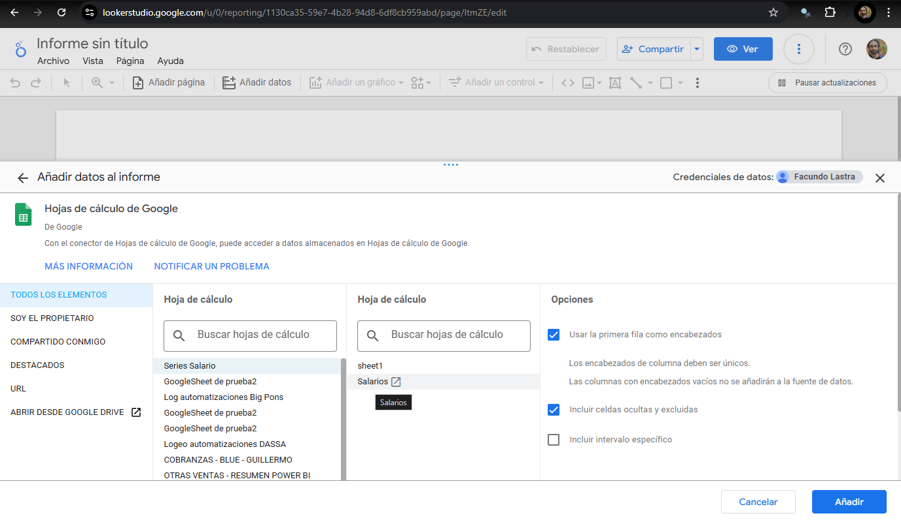
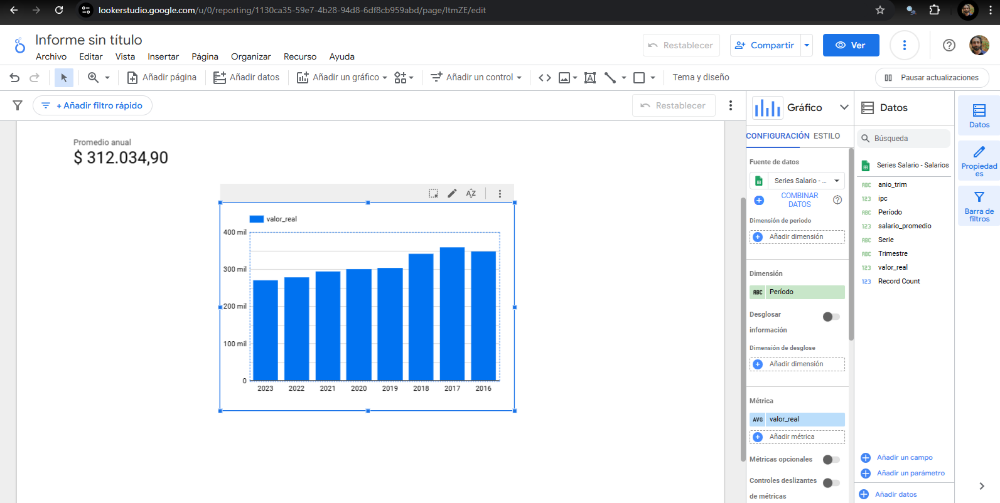

# Organización y lectura de archivos

R nos permite escrbir, borrar y guardar archivos, de manera que podemos interactuar con la organización del directorio de nuestro disco local. En RBase tenemos el comando `list.files()` que nos permite listar los archivos de un directorio. Si no le ponemos ningún argumento, por defecto nos devuelve una lista con los archivos del directorio de trabajo en forma de un vector.

```{r list-files}
# Listar los archivos del directorio de trabajo
archivos <- list.files()

archivos
```

Ingresando un directorio como argumento es posible también acceder a los nombres de los archivos en una carpeta específica.

```{r list-files-dir}
# Listar los archivos de un directorio específico
archivos_carpeta <- list.files("bases")
archivos_carpeta
```

Con estos vectores podemos hacer un loop para leer los archivos y/o utilizar un patrón de texto para utilizar sólo los archivos que cumplen con ese patrón. A continuación presentamos un ejemplo de ello en una parte de un script del repositorio **precariedad.mundial**, utilizado para 'pegar' las bases nacionales y crear una base homogénea.

```{r eval=FALSE}
#Este chunck solo corre en el contexto del repositorio precariedad.mundial
rutas <- list.files("Bases_homog/",full.names = T,pattern = ".rds")
Base <- data.frame()
for(i in rutas){
  base_temp<- readRDS(i) %>%
    mutate(PERIODO = as.character(PERIODO),
           EDAD = as.numeric(EDAD),
           ING = as.numeric(ING))
Base <-   bind_rows(Base,base_temp)
print(i)
}
```

En este ejemplo se define el elemento `rutas`, que es un vector con las rutas completas de los archivos con formato .rds en la carpeta **Bases_homog**. Luego se crea un dataframe vacío y se itera sobre cada ruta, leyendo cada archivo y guardándolo en una base temporal. Luego se unen las bases con `bind_rows()` y se imprime la ruta para saber en qué archivo se está trabajando. Esta lógica de trabajo en loops es muy utilizada para cargar información de distitnas fuentes.

# Web Scraping

**Web scraping** es la técnica de extraer datos de páginas web de manera automatizada. Utilizando R podemos acceder a páginas web y extraer los datos necesarios de manera eficiente, evitando copiar manualmente la información. En R, el paquete `rvest` es el más utilizado para realizar tareas de web scraping de forma sencilla y efectiva. Otros paquetes útiles incluyen `httr` para manejar solicitudes HTTP y `xml2` para procesar el HTML de las páginas. Para sitios web más complejos (principalmente aquellos programados en Java) es recomendable usar `Selenium`.

Para hacer web scraping es necesario conocer algunos conceptos básicos de HTML, que es el lenguaje que se utilza en la web para estructurar y presentar la información. Las páginas web están compuestas por elementos HTML, que se organizan en una estructura jerárquica de etiquetas. Por ejemplo, un título de una noticia puede estar dentro de una etiqueta `<h3>`, mientras que un párrafo de texto puede estar dentro de una etiqueta `<p>`. Para extraer información de una página web, necesitamos identificar las etiquetas HTML que contienen los datos que queremos obtener. Desde los navegadores podemos acceder a este código con la herramienta `inspeccionar`.

```         
<!DOCTYPE HTML>
<html>
  <head>
    <meta charset="utf-8" />
    <title>Ejemplo1</title>
  </head>
  <body>
    <p>Párrafo de ejemplo</p>
  </body>
</html>
```

Comencemos mirando cómo se ve una página de noticias usando `rvest`.

```{r}
# Instalar y cargar el paquete rvest si no lo tenes instalado
# install.packages("rvest")

library(rvest)

page <- read_html("https://www.pagina12.com.ar")

class(page)

page

```

Cuando ingresamos la dirección de la página web en la función `read_html()` de rvest, obtenemos un objeto HTML del que podemos analizar y extraer información. HTML es el código que nuestros navegadores 'leen' para luego mostrarnos una página web. Para extraer datos de la página, necesitamos **parsear** la información del HTML para poder convertirla en datos estructurados. **Parsear datos** se refiere al proceso de analizar y estructurar el contenido de una página web para extraer información útil de manera organizada. Generalmente, necesitamos primero identificar las etiquetas HTML que contienen la información que queremos obtener y luego extraer información de ellas. En nuestro ejemplo, si queremos extraer los títulos de las noticias de la página principal, podemos buscar las etiquetas `<h3>` que contienen los títulos. El comando `html_nodes()` nos permite seleccionar nodos HTML de la página, y `html_text()` nos permite extraer el texto de los nodos seleccionados.

```{r}
# Ejemplos para extraer texto según tags
h1_tags <- page %>% html_nodes("h1") %>% html_text()

h2_tags <- page %>% html_nodes("h2") %>% html_text()

h3_tags <- page %>% html_nodes("h3") %>% html_text()

p_tags <- page %>% html_nodes("p") %>% html_text()

```

En la práctica del web scraping se suelen combinar técnicas de parseo de datos con la extracción de información por matcheo de patrones con expresiones regulares. Por ejemplo, si estamos navegando sobre una lista de precios, podemos extraer los importes por medio de la coincidencia con caracteres numéricos, el símbolo "$" 0 los separadores decimales y de miles.

### ¿Qué es XPath?

Hay distintos métodos para acceder a la información que está en una página web. El más utilzado actualmente es XPath, un lenguaje de consulta para seleccionar nodos en un documento HTML. Permite navegar a través de la estructura jerárquica de un documento y seleccionar elementos específicos basados en su posición, atributos, o contenido. **XPath** es un lenguaje utilizado para navegar y seleccionar elementos dentro de documentos estructurados como XML y HTML. En el contexto del *web scraping*, es una herramienta poderosa para localizar y extraer datos específicos de una página web. XPath trabaja con una representación en forma de árbol de un documento HTML o XML. Cada etiqueta HTML (como `<div>`, `<h1>`, `<p>`) se considera un **nodo** dentro del árbol, y XPath permite especificar rutas hacia estos nodos.

#### Sintaxis básica de XPath

1. **Navegar por niveles del árbol**:
   - `/`: Selecciona desde el nodo raíz. Por ejemplo, `/html/body` selecciona el `<body>` del documento.
   - `//`: Selecciona nodos desde cualquier parte del documento. Por ejemplo, `//p` selecciona todos los `<p>` sin importar su ubicación.

2. **Seleccionar por etiqueta**:
   - `//div`: Selecciona todos los elementos `<div>`.

3. **Seleccionar por atributo**:
   - `//*[@id='titulo']`: Selecciona cualquier elemento con el atributo `id="titulo"`.
   - `//a[@href='/contacto']`: Selecciona el enlace `<a>` cuyo atributo `href` sea `/contacto`.

4. **Seleccionar texto dentro de un nodo**:
   - `//h1/text()`: Extrae el texto dentro de un elemento `<h1>`.

5. **Condiciones adicionales (filtros)**:
   - `//ul/li[1]`: Selecciona el primer `<li>` dentro de un `<ul>`.
   - `//table/tr[td[contains(., 'Argentina')]]`: Encuentra una fila `<tr>` en una tabla que contiene la palabra "Argentina".

Veamos como funciona ahora en la página de noticias que estábamos analizando.

```{r}
# Ejemplo para extraer texto usando XPath

all_h2_in_xpath <- page %>% html_nodes(xpath = '//h2') %>% html_text()

```

Probemos ahora con una página de datos oficiales de Argentina.


```{r eval=FALSE  }
page2 <- read_html("https://www.argentina.gob.ar/encuesta-de-indicadores-laborales")

# Obtengo infromación usando Xpath
h2_tags_xpath <- page2 %>% html_nodes(xpath ='//*[@id="block-system-main"]/section[1]/article/div/div/div/div/table') %>% html_text()
```

Una vez obtenida la información por Xpaht podemos procesarla y guardarla como dataframe

```{r eval=FALSE}
library(tidyverse)

lines <- str_split(h2_tags_xpath, "\n")[[1]]

cleaned_lines <- lines %>%
  str_trim() %>%
  .[. != ""]

encabezados <- cleaned_lines[1:2] 
regiones <- cleaned_lines[c(3,6,9)]
mensual_values <- cleaned_lines[c(4,7,10)]
anual_values <- cleaned_lines[c(5,8,11)]

# Combino datos en un df
df <- data.frame(
  regiones,
  mensual_values,
  anual_values
)

colnames(df) <- c("Region", encabezados)

print(df)
```

# Tareas programadas en Windows

La programación de tareas consiste en la ejecución automática de un script en un momento específico. Esto es útil para tareas que se repiten con frecuencia, como la actualización de datos y la generación de reportes. Dependiendo el sistema operativo que tengamos, vamos a tener distintas formas de programar tareas (en este curso nos centramos en Windows). Para Linux existe una forma muy cómoda de programar tareas mediante comando de código con `CRON` ([ver aqu](https://es.wikipedia.org/wiki/Cron_(Unix))í). En Windows podemos utilizar el Programador de Tareas, que ejecuta progamas según desencadenadores. Para ello, vamos a necesitar el archivo .bat que nos permitirá ejecutar el script de R. Los .bat son archivos de procesamiento por lotes que contienen una serie de comandos que se ejecutan en secuencia, como si lo estuvieramos ejecutando por la consola de CMD o powershell. En este caso, el archivo .bat va a contener el comando para ejecutar el script de R.

```         
"C:\Program Files\R\R-4.1.1\bin\Rscript.exe" "C:\Users\Usuario\Documents\script.R"
```

El archivo .bat imita básicamente la ejecución de comandos en el CMD o powershell de Windows. En este caso le estamos diciendo a nuestra computadora que ejecute `script.R` con el comando `Rscript.exe` que se encuentra en la carpeta de instalación de R. Luego le pasamos la ruta del archivo de R que queremos ejecutar. Para programar la tarea, abrimos el Programador de Tareas de Windows y creamos una tarea nueva. En la pestaña de desencadenadores seleccionamos la frecuencia con la que queremos que se ejecute el script, y en la pestaña de acciones le asignamos el archivo .bat que creamos. De esta manera, el script de R se va a ejecutar automáticamente en el momento que lo hayamos programado.

# Envios de correo electrónico

Con R es posible enviar correos electrónicos de manera automática. Para ello, vamos a utilizar el paquete `blastula`, que nos permite enviar correos con contenido HTML. Para enviar un correo, vamos a tener que configurar un servidor SMTP, que es el servidor que se encarga de enviar correos electrónicos. En este caso, vamos a utilizar el servidor de Gmail. Para ello, debemos configurar nuestra cuenta de Gmail para que permita el acceso de aplicaciones menos seguras y generar las credenciales.

```{r eval=FALSE}
library(blastula)

create_smtp_creds_file('credenciales_gmail', 
                       user= 'marajadesantelmo@gmail.com', 
                       provider= 'gmail')
```

Una vez que ya generamos las credenciales podemos generar un correo electrónico y enviarlo como si estuviéramos haciéndolo desde un usuario de gmail.

```{r eval=FALSE}
library(tidyverse)

# Crear un mensaje de correo electrónico
email <- compose_email(
  body = md("Este es un correo de prueba enviado desde R utilizando el paquete blastula.")
)

# Enviar el correo electrónico
email %>%
    smtp_send(
        from = "marajadesantelmo@gmail.com",   
        to = "marajadesantelmo@gmail.com",         
        subject = "Correo de prueba desde R", 
        credentials = creds_file("credenciales_gmail") 
    )
```

# Google Sheets y R

La interacción con **Google Sheets** desde R permite automatizar el manejo de datos en hojas de cálculo, lo que facilita la colaboración y el análisis. Utilizando el paquete `googlesheets4` podemos leer, escribir y actualizar datos en Google Sheets, mientras que `googledrive` facilita la autenticación y el manejo de archivos en Google Drive. Antes de comenzar a interactuar con Google Sheets, hay que tener instalado los paquetes necesarios. Luego vas a poder autenticarte con tu usuario corriendo `gs4_auth()`.

```{r install-packages, eval=FALSE, message=TRUE, warning=FALSE}
# Instalar los paquetes si no están instalados 
# install.packages("googlesheets4") 
# install.packages("googledrive")  
library(googlesheets4)
library(googledrive)
gs4_auth() 
```

Cuando corremos la autenticación por primera vez, se nos va a abrir una ventana en el navegador para que logearse con nuestra cuenta de Google. Luego de hacerlo, vamos a poder interactuar con Google Sheets desde R. En caso de que ya lo hayamos hecho antes, tan solo tenemos que seleccionar la cuenta con la que queremos iniciar sesión. Luego podemos crear una hoja de cálculo nueva pasándole como argumentos a `gs4_create` un nombre y una lista de data frames que queremos incluir en las distintas hojas de la planilla.

## Manipulando sheets desde R

Los sheets van a estar representados en nuestro entorno de trabajo como objetos de R. Para crear un elemento que represente un sheet de GoogleSheet lo definimos de la siguiente manera.

```{r creando_sheet, eval=FALSE}
gsheet <- gs4_create("GoogleSheet de prueba2", sheets = list(sheet1 = data.frame(A = 1:3, B = 4:6)))
```

Así creamos el objeto `gsheet`, que representa en nuestro entorno de trabajo a una hoja de cálculo en GoogleSheets, lo que nos permite subir y bajar información desde y hacia nuestro entorno, como también modificar atributos del sheet, como ser su nombre y los usuarios con quien lo compartimos. Un comando muy útil va a ser `as_id()`, que nos devuelve el id de la hoja del cálculo, con el cual vamos a poder operar sobre el elemento. En general, los ids de los sheets están disponibles en su URL.

```{r, eval=FALSE}
as_id(gsheet)
```

Por ejemplo, en la URL [`https://docs.google.com/spreadsheets/d/1X2Y3Z/edit#gid=0`](https://docs.google.com/spreadsheets/d/1X2Y3Z/edit#gid=0), el id es `1X2Y3Z`. Para leer una hoja de cálculo existente, podemos utilizar la función `gs4_get()` pasándole como argumento el id de la hoja de cálculo. También podemos compartir el sheet desde el paquete `googledrive`, que lo comporte al igual que lo haríamos normalmente cuando interactuamos desde el sitio de Drive o GoogleSheets.

```{r compartiendo_sheet, eval=FALSE}
library(googledrive)  
drive_auth()   
drive_share(as_id(gsheet), email_address = "marajadesantelmo@gmail.com", role = "writer")
```

Si todo salió bien, nos debería llegar un correo con el link a la hoja de cálculo, tal como nos llega cuando alguien nos comparte un documento de Drive. Además vamos a poder hacer muchas de las operaciones que normalmente hacemos en Google Sheets, como agregar valores, filas, columnas, hojas, como también subir y bajar información. Por ejemplo, podríamos crear una hoja y subir la información que acabamos de scrapear.

```{r subiendo_datos, eval=FALSE}
# Subo los datos scrapeados a una nueva hoja llamada "Mis Datos" 
sheet_write(data = df,  ss = as_id(gsheet), sheet = "Mis datos")
range_clear(ss = as_id(gsheet), sheet = "sheet1") 
```

# LookerStudio

LookerStudio es la herramienta de visualización de datos desarrollada por Google. Al igual que PowerBI, permite realizar visualizaciones en informes dinámicos con filtros interactivos. Las principales ventajas de LookerStudio es que los informes se comparten muy fácilmente (de la misma manera que un archivo de Drive) y que posee una interacción muy dinámica con GoogleSheets. Su principal desventaja es que los informes pueden volverse lentos si se les carga un gran volumen de datos. El uso combinado de R, GoogleSheet y LookerStudio puede resultar muy funcional para completar el flujo de datos en las etapas de extracción, procesamiento, almacenamiento y visualización. 

Veamos un ejemplo con los materiales trabajados en las clases anteriores. Primero vamos a construir una serie de salarios con el paquete eph y la vamos a deflactar: 

```{r subiendo_info, eval=FALSE}
library(tidyverse)
library(openxlsx)
library(eph)
bases_2021_2023 <- eph::get_microdata(year = 2016:2023,period =1:4)
ipc_trimestral <- read.xlsx(xlsxFile = "bases/ipc_trimestral.xlsx")

bases_2021_2023 <- bases_2021_2023 %>% 
  mutate(anio_trim  = paste0(ANO4,"T",TRIMESTRE))

base_salarios <- bases_2021_2023 %>% 
  filter(ESTADO == 1, CAT_OCUP ==3,P21>0) %>% 
  group_by(anio_trim) %>% 
  summarise(salario_promedio = weighted.mean(P21,PONDIIO)) %>% 
  left_join(ipc_trimestral)

base_salarios


```
Luego vamos a pasar nuestra serie a términos reales usando la función que vimos en la Clase 5

```{r, eval=FALSE}
deflacta_series <- function(df,valor_nominal,indice_precios,col_periodo,base_elegida){

indice_base <- df[indice_precios]/df[indice_precios][df[col_periodo] == base_elegida]*100 

valor_real <- df[valor_nominal]/indice_base*100

df["valor_real"]  <- valor_real
  return(df)  
} 

datos_deflactados <- deflacta_series(df = base_salarios,
                valor_nominal = "salario_promedio",
                col_periodo = "anio_trim",
                indice_precios = "ipc",
                base_elegida = "2023T4")

datos_deflactados

```

Y por último nos resta subir los datos a GoogleSheets. Primero realizamos la autenticación y creamos la hoja de cálculo, luego la compartimos y subimos la información.

```{r subiendo_mas_info, eval=FALSE}
library(googlesheets4)
library(googledrive)
gs4_auth()
```
```{r subiendo_info2, eval=FALSE}
gsheet <- gs4_create("Series Salario"))
```
Para poder trabajar con el sheet desde el navegador, nos podemos compartir la hoja de cálculo desde R y nos llegará un correo con el link de acceso. También podemos compartirla con otrxs colaboradorxs.

```{r subiendo_info3, eval=FALSE}

drive_share(as_id(gsheet), email_address = "marajadesantelmo@gmail.com", role = "writer")

sheet_write(data = datos_deflactados,  ss = as_id(gsheet), sheet = "Salarios")

```
Si todo salió bien, vamos a poder acceder a nuestro sheet desde LookerStudio como lo vemos en la siguiente imagen.



Cuando tengas los datos cargados en tu informe, vas a poder visualizar los datos en el panel de la derecha y crear visualizaciones interactivas con el panel que está a su izquierda.


