# 📊 Curso ASET - R para Análisis de Datos Laborales

**Docentes:** Facundo Lastra y Guido Weksler

---

## 📚 Tabla de Contenidos

- [📖 Descripción del Curso](#descripción-del-curso)
- [🎯 Objetivos](#objetivos)
- [📋 Programa](#programa)
- [🛠️ Configuración del Entorno](#configuración-del-entorno)
- [📥 Materiales](#materiales)
- [🎥 Grabaciones](#grabaciones)
- [📞 Contacto](#contacto)

## 📖 Descripción del Curso

Este curso está diseñado para profesionales y estudiantes interesados en el análisis de datos laborales utilizando R. Los materiales se encuentran estructurados por clases, con contenidos descargables y grabaciones disponibles.

## 🎯 Objetivos

- Dominar las herramientas fundamentales de R para análisis de datos
- Aplicar técnicas de análisis específicas para datos laborales y EPH
- Desarrollar habilidades en visualización de datos y automatización
- Integrar herramientas modernas como Git, Power BI y Google Sheets

## 🛠️ Configuración del Entorno

> [!TIP]
> **¿Primera vez usando R?** Asegúrate de tener instaladas las siguientes herramientas.

| Herramienta | Versión | Link de Descarga |
|-------------|---------|------------------|
| R | ≥ 4.0 | [CRAN](https://cran.r-project.org/) |
| RStudio/VS Code | Última | [RStudio](https://rstudio.com/products/rstudio/download/) |
| Git | Última | [Git](https://git-scm.com/downloads) |

## 📋 Programa

### 📈 Progreso del Curso

```mermaid
gantt
    title Cronograma del Curso
    dateFormat  X
    axisFormat %d

    section Fundamentos
    R Base           :done, 0, 1
    EPH y Tidyverse  :done, 1, 2
    
    section Análisis
    Indicadores      :active, 2, 3
    Visualización    :3, 4
    
    section Avanzado
    Markdown & Loops :4, 5
    Git & Automatiz. :5, 6
    Power BI         :6, 7
    Integración      :7, 8
```

### 🎓 Módulos y Contenidos

  

### 🎯 **Objetivos**
- Introducción al lenguaje R y su sintaxis
- Configuración del entorno de desarrollo
- Conceptos fundamentales de programación

### 📂 **Contenidos:**

- ✅ Descripción del programa "R" y lógica sintáctica
- ✅ Presentación de Visual Studio Code para R
- ✅ Caracteres especiales y operadores
- ✅ Definición de Objetos: Valores, Vectores, DataFrames, Tibbles, Listas
- ✅ Tipos de variables (numérica, caracteres, factores, lógicas)
- ✅ Funciones básicas
- ✅ Primera introducción a GitHub
- ✅ Programación con IA

### 🔗 **Enlaces**
- [📁 Materiales](./Clase%201%20-%20Presentacion%20y%20R%20base/)
- [💻 Ejercicios](./Clase%201%20-%20Presentacion%20y%20R%20base/script_clase.R)

  

### 🎯 **Objetivos**
- Dominar la Encuesta Permanente de Hogares (EPH)
- Introducción al ecosistema Tidyverse
- Técnicas de limpieza y transformación de datos

### 📂 **Contenidos:**
- ✅ Presentación de la EPH y su estructura
- ✅ Lectura de bases en diferentes formatos
- ✅ Análisis exploratorio de datos
- ✅ Limpieza: renombrar y recodificar variables
- ✅ Creación y selección de variables
- ✅ Filtros y agrupamientos
- ✅ Tidyr: pivot_longer y pivot_wider
- ✅ Operaciones de unión (Joins y bind_rows)
- ✅ Medidas de resumen estadístico

### 🔗 **Enlaces**
- [📁 Materiales](./Clase%202%20-%20EPH%20e%20Intro%20a%20Tidyverse/)
- [💻 Script de clase](./Clase%202%20-%20EPH%20e%20Intro%20a%20Tidyverse/script_clase2.R)

  

### 🎯 **Objetivos**
- Profundizar en herramientas avanzadas de Tidyverse
- Comprender conceptos de informalidad y precariedad laboral
- Desarrollar indicadores de comparación internacional

### 📂 **Contenidos:**
- ✅ Tidyverse avanzado: selectores y funciones across()
- ✅ Tratamiento de valores faltantes (NA's)
- ✅ Conceptos de informalidad y precariedad laboral
- ✅ Operacionalización con variables EPH
- ✅ Indicadores unidimensionales de precariedad
- ✅ Co-ocurrencia de fenómenos
- ✅ Base "Precariedad Mundial" y comparación internacional

### 🔗 **Enlaces**
- [📁 Materiales](./Clase%203%20-%20Indicadores%20de%20Precariedad%20-%20Tidyverse2/)
- [📊 Práctica](./Clase%203%20-%20Indicadores%20de%20Precariedad%20-%20Tidyverse2/Clase3_Practica%20EPH.Rmd)

  

### 🎯 **Objetivos**
- Dominar ggplot2 para visualización de datos
- Crear gráficos estáticos e interactivos
- Aplicar principios de diseño gráfico

### 📂 **Contenidos:**
- ✅ Introducción al paquete ggplot2
- ✅ Lógica de capas en el armado de gráficos
- ✅ Variantes de geom (línea, puntos, barras, boxplot)
- ✅ Aesthetics de los gráficos
- ✅ Facets para gráficos múltiples
- ✅ Gráficos interactivos con ggplotly

### 🔗 **Enlaces**
- [📁 Materiales](./Clase%204%20-%20Visualizacion%20en%20R%20-%20ggplot/)
- [📊 Práctica](./Clase%204%20-%20Visualizacion%20en%20R%20-%20ggplot/Clase%204%20-%20Practica%20Consignas.html)

  

### 🎯 **Objetivos**
- Crear documentos reproducibles con R Markdown
- Implementar estructuras de control y automatización
- Desarrollar funciones personalizadas

### 📂 **Contenidos:**
- ✅ R Markdown y R Notebook para documentos interactivos
- ✅ Opciones de visualización de código en reportes
- ✅ Formato de gráficos y tablas en informes
- ✅ Caracteres especiales y recursos multimedia
- ✅ Código embebido para automatización
- ✅ Estructuras iterativas (Loops)
- ✅ Creación de funciones propias

### 🔗 **Enlaces**
- [📁 Materiales](./Clase%205%20-%20Markdown,%20loops%20y%20funciones/)
- [📄 Markdown](./Clase%205%20-%20Markdown,%20loops%20y%20funciones/markdown/)
- [♾️ Funciones](./Clase%205%20-%20Markdown,%20loops%20y%20funciones/funciones%20y%20loops/)

  

### 🎯 **Objetivos**
- Dominar Git y GitHub para control de versiones
- Implementar automatizaciones y web scraping
- Manejar datos faltantes e imputaciones

### 📂 **Contenidos:**
- ✅ Introducción a Git y comandos esenciales
- ✅ Funcionalidades avanzadas de GitHub (Issues, Branches, Merges)
- ✅ GitHub Pages para publicación
- ✅ Automatización de procesos con R
- ✅ Expresiones regulares
- ✅ Introducción al Web Scraping
- ✅ Imputación de datos faltantes

### 🔗 **Enlaces**
- [📁 Materiales](./Clase%206%20-%20Github,%20automatizaciones,%20web%20scraping/)
- [💻 Script](./Clase%206%20-%20Github,%20automatizaciones,%20web%20scraping/script_clase6.R)

  

### 🎯 **Objetivos**
- Integrar R con Power BI
- Crear dashboards interactivos profesionales
- Publicar y compartir reportes empresariales

### 📂 **Contenidos:**
- ✅ Introducción a Power BI y su ecosistema
- ✅ Conexión a bases de datos múltiples
- ✅ Transformación de datos con Power Query
- ✅ Creación de visualizaciones avanzadas
- ✅ Diseño de Dashboards interactivos
- ✅ Publicación y compartir reportes

### 🔗 **Enlaces**
- [📁 Materiales](./Clase%207%20-%20PowerBI/)
- [📊 Scripts](./Clase%207%20-%20PowerBI/scripts_pbi.R)

  

### 🎯 **Objetivos**
- Integrar R con Google Sheets y servicios en la nube
- Crear flujos de datos automatizados
- Desarrollar dashboards con Looker

### 📂 **Contenidos:**
- ✅ Conexión a Google Sheets desde R
- ✅ Autenticación y APIs de Google
- ✅ Armado de flujos de datos automatizados
- ✅ Creación de visualizaciones con Looker
- ✅ Diseño de dashboards empresariales
- ✅ Publicación y automatización de reportes

### 🔗 **Enlaces**
- [📁 Materiales](./Clase%208%20-%20GoogleSheets%20y%20Looker/)
- [💻 Script](./Clase%208%20-%20GoogleSheets%20y%20Looker/script_clase8.R)

---

## 🚀 ¿Cómo usar este repositorio?

### Para Estudiantes 👨‍🎓👩‍🎓

1. **Clona** este repositorio
2. **Navega** a la clase correspondiente  
3. **Ejecuta** los scripts en orden
4. **Practica** con los ejercicios

### Para Docentes 👨‍🏫👩‍🏫

- [📋 Guía de Enseñanza](#)
- [💡 Recursos Adicionales](#)
- [❓ FAQ Docentes](#)

---

## 📥 Materiales

Todos los materiales están disponibles en las carpetas correspondientes de cada clase. Incluyen:

- **Scripts de R** para práctica
- **Bases de datos** de ejemplo
- **Documentos HTML** con contenido teórico
- **Ejercicios prácticos** resueltos

## 🎥 Grabaciones

> [!NOTE]  
> Las grabaciones de las clases estarán disponibles próximamente.

---

## 📞 Contacto

**Centro de Estudios sobre Población, Empleo y Desarrollo (CEPED)**  
*Facultad de Ciencias Económicas - Universidad de Buenos Aires*

---

### 📝 Licencia

Este material está bajo licencia Creative Commons. Puedes usarlo libremente citando la fuente.

### 🌟 ¿Te gustó el curso?

¡Dale una ⭐ a este repositorio y compártelo!

